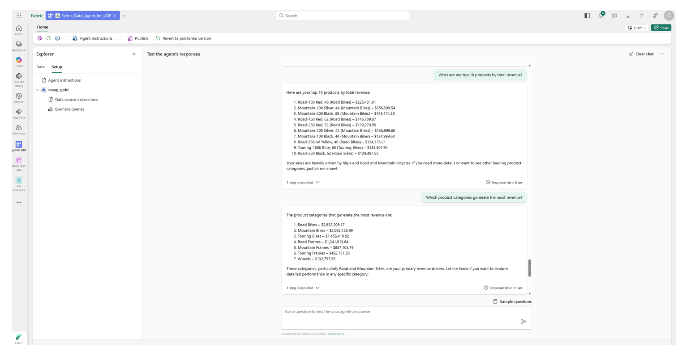

# Unified data foundation with Fabric solution accelerator

This solution accelerator delivers a unified data foundation using **Microsoft Fabric**, **OneLake**, **Microsoft Purview**, and **Azure Databricks** for integrated, governed analytics. Built on [medallion lakehouse architecture](https://learn.microsoft.com/en-us/fabric/onelake/onelake-medallion-lakehouse-architecture) principles, it includes domain schemas and sample data for shared domains (customer, product), finance, and sales, along with pre-built Power BI dashboards featuring advanced sales analytics. The solution provides Microsoft Purview governance for compliance and transparency, Azure Databricks integration via Fabric's data mirroring and shortcuts, Fabric Data Agent for natural language data queries, and Copilot for Power BI for interactive report exploration.

The solution accelerator is designed for flexibility, allowing you to deploy the core Microsoft Fabric architecture alone or in combination with Microsoft Purview and/or Azure Databricks based on your organizational needs and existing investments. The solution ensures seamless integration across components, enabling you to build a unified data platform that supports diverse analytics use cases while maintaining robust governance and compliance. By leveraging this solution accelerator, you can accelerate your data modernization journey, break down data silos, and empower your organization with actionable insights from a unified data foundation.

You can deploy incrementally—Microsoft Fabric alone or combined with Purview and/or Databricks. See [Solution overview](#solution-overview) for architecture options.

**Key use cases:**

- **Unified data platform** — Microsoft Fabric as the core architecture with optional integration to other platforms
- **Master data management** — Customer and product data models, source file processing, validation, and consolidation
- **Cross-platform sales analytics** — Analyze data across Fabric and Azure Databricks seamlessly
- **Finance data foundation** — Data management and reporting-ready structures for finance domain
- **Interactive Power BI dashboards** — Sales insights with actionable business intelligence
- **Fabric Data Agent** — Natural language queries for intelligent, conversational data exploration
- **Copilot for Power BI** — AI-powered Q&A directly within reports

 

[**SOLUTION OVERVIEW**](#solution-overview) \| [**QUICK DEPLOY**](#quick-deploy) \| [**BUSINESS SCENARIO**](#business-use-case) \| [**SUPPORTING DOCUMENTATION**](#supporting-documentation)

 

<h2 id="solution-overview">
Solution overview
</h2>
This solution accelerator offers a **flexible, plug-and-play architecture** with four deployment options. Choose the configuration that best fits your organizational needs:

| Option | Architecture | Description |
| :----: | ------------ | ----------- |
| **1** | Microsoft Fabric *(Default)* | Core medallion lakehouse architecture—the foundation for all other options |
| **2** | Microsoft Fabric + Microsoft Purview | Option 1 + data governance and compliance capabilities |
| **3** | Microsoft Fabric + Azure Databricks | Option 1 + cross-platform analytics with Databricks integration |
| **4** | Microsoft Fabric + Microsoft Purview + Azure Databricks *(Full)* | Options 1 + 2 + 3 combined—complete deployment with governance and cross-platform analytics |

> 💡 **Note:** Fabric Data Agent and Copilot for Power BI are included in all architecture options.

For detailed feature descriptions and technical specifications of each option, see [Solution Architecture and Options](./docs/TechnicalArchitecture.md).

### Solution architecture

The architecture below illustrates the solution architecture built with option 4.

|  |
| -------------------------------------------------------- |

### How to customize

If you'd like to customize the solution accelerator, here are some common areas to start:

You can modify the data models and notebooks in different folders under the `src` folder. Please note that if any part is modified, you will need to modify the associated parts accordingly, as the data model (schemas and tables), notebooks, Power BI semantic models, Power BI dashboards, and sample data are a cohesive set of resources working together as designed.

| Customization Area | Description |
|---|---|
| [Customize Schema](./src/fabric/notebooks/schema) | Modify data models, schemas, and table definitions |
| [Customize Fabric Data Agent](./docs/FabricDataAgentGuide.md) | Configure natural language query capabilities |
| [Update Data Management Notebooks](./src/fabric/notebooks/data_management) | Adjust data lifecycle and management processes |
| [Update Bronze to Silver Processing](./src/fabric/notebooks/bronze_to_silver) | Modify raw data validation and transformation logic |
| [Update Silver to Gold Processing](./src/fabric/notebooks/silver_to_gold) | Customize data enrichment and aggregation |
| [Update Runner Notebooks](./src/fabric/notebooks) | Adjust orchestration when notebooks are added or removed |

### Additional resources

| Resource | Description |
|---|---|
| [What's New in Microsoft Fabric](https://learn.microsoft.com/en-us/fabric/fundamentals/whats-new) | Latest features and updates |
| [Microsoft Fabric Blog](https://blog.fabric.microsoft.com/en-us/blog) | News, tips, and best practices |
| [Fabric Adoption Roadmap](https://learn.microsoft.com/en-us/power-bi/guidance/fabric-adoption-roadmap) | Guidance for organizational adoption |
| [Copilot for Power BI Guide](./docs/CopilotForPowerBIGuide.md) | Setup and usage instructions |

 

### Key features

  
Click to learn more about the key features this solution enables

  - **Core Medallion Architecture in Fabric**  Core medallion architecture in unified Microsoft Fabric Platform, with cross-domain data models covering shared (customer, product), finance, and sales across multiple channels. The solution is packaged with 48 Fabric PySpark Notebooks and 2 SQL scripts. All of them are deployed to the Fabric workspace with an automated deployment process. 
  - **Raw data in Bronze to Silver Lakehouse Tables with Automated Execution**  Complete and automated process for raw data processing from bronze to validated data populated to silver tables. 
  - **Silver Lakehouse Data Flows into Gold Lakehouse with Automated Execution**  Complete and automated process for validated data in silver tables flowing into gold tables for enrichment and utilization. 
  - **Power BI Semantic Models and Sales Analysis Dashboard**  Power BI semantic models using gold tables, producing dashboards with comprehensive sales analysis. 
  - **Fabric Data Agent for Business Data Analysis**  Fabric Data Agent can help you perform data analysis using natural business language. For detailed setup and usage, refer to [Fabric Data Agent Guide](./docs/FabricDataAgentGuide.md).
  - **Copilot for Power BI**  The built-in Copilot for Power BI can help you perform report analysis using natural business language. For detailed setup and usage, refer to [Copilot for Power BI Guide](./docs/CopilotForPowerBIGuide.md).
  - **Integration with Azure Databricks**  
    Integration with Azure Databricks with Mirroring and Shortcut to eliminate the need for data movement. Additional sales data from Azure Databricks is made available to Fabric via data mirroring and shortcut. 
  - **Microsoft Purview for Data Governance**  
    Microsoft Purview reviews and governs selected resources in the Microsoft Fabric workspace, providing capabilities such as scanning data, data discovery, and metadata for the data stored in the Fabric workspace gold tier.

  

<h2 id="quick-deploy">
Quick deploy
</h2>

### Deployment methods

Deploy this solution accelerator to your Azure subscription using either automated or manual deployment methods.

> ⚠️ **Important:** Before deploying, check [capacity requirements](./docs/DeploymentGuideFabric.md#software-requirements) to ensure sufficient Azure Fabric capacity is available in your subscription.

#### Option 1: Automated Deployment (Recommended)

📖 **[Click here to launch the automated deployment guide](./docs/DeploymentGuideFabric.md)** and choose your preferred environment for one-click automated deployment:

|  |  |  | [&message=Open&color=blue&logo=visualstudiocode&logoColor=white)](https://vscode.dev/azure/?vscode-azure-exp=foundry&agentPayload=eyJiYXNlVXJsIjogImh0dHBzOi8vcmF3LmdpdGh1YnVzZXJjb250ZW50LmNvbS9taWNyb3NvZnQvdW5pZmllZC1kYXRhLWZvdW5kYXRpb24td2l0aC1mYWJyaWMtc29sdXRpb24tYWNjZWxlcmF0b3IvcmVmcy9oZWFkcy9tYWluL2luZnJhL3ZzY29kZV93ZWIiLCAiaW5kZXhVcmwiOiAiL2luZGV4Lmpzb24iLCAidmFyaWFibGVzIjogeyJhZ2VudElkIjogIiIsICJjb25uZWN0aW9uU3RyaW5nIjogIiIsICJ0aHJlYWRJZCI6ICIiLCAidXNlck1lc3NhZ2UiOiAiIiwgInBsYXlncm91bmROYW1lIjogIiIsICJsb2NhdGlvbiI6ICIiLCAic3Vic2NyaXB0aW9uSWQiOiAiIiwgInJlc291cmNlSWQiOiAiIiwgInByb2plY3RSZXNvdXJjZUlkIjogIiIsICJlbmRwb2ludCI6ICIifSwgImNvZGVSb3V0ZSI6IFsiYWktcHJvamVjdHMtc2RrIiwgInB5dGhvbiIsICJkZWZhdWx0LWF6dXJlLWF1dGgiLCAiZW5kcG9pbnQiXX0=) |
|---|---|---|---|

#### Option 2: Manual Deployment

For granular control over each deployment step or to integrate with existing resources:

- **Fabric-only architecture:** Follow the [manual deployment guide](./docs/DeploymentGuideFabricManual.md) for step-by-step instructions with options to use existing Fabric capacity
- **Full architecture (Fabric + Purview + Databricks):** Use the [comprehensive deployment guide](./docs/DeploymentGuide.md) for all architecture options
 

### Prerequisites and costs

To deploy this solution accelerator, ensure you have access to an [Azure subscription](https://azure.microsoft.com/free/) with the following permissions:

- **Contributor** role at the subscription level
- **Role Based Access Control (RBAC)** permissions to assign roles at the subscription and/or resource group level
- Ability to create resource groups, resources, and app registrations

For detailed setup instructions, see [Azure Account Set Up](./docs/AzureAccountSetUp.md).

**Additional setup for extended architectures:**

| Architecture Option | Additional Setup Required |
|---|---|
| Options 3 & 4 (with Databricks) | [Provisioning Azure Databricks](./docs/SetupDatabricks.md) |
| Options 2 & 4 (with Purview) | [Provisioning Purview](./docs/SetupPurview.md) |

Licenses for Microsoft Fabric, Azure Databricks, and Microsoft Purview are required to deploy this solution accelerator. Costs will vary based on the architecture option you choose and the scale of your deployment. Below is a high-level overview of the cost considerations for each architecture option:

- **Microsoft Fabric:** Licensing and cost information can be found at [Microsoft Fabric concepts and licenses](https://learn.microsoft.com/en-us/fabric/enterprise/licenses) and [Microsoft Fabric Pricing](https://azure.microsoft.com/en-us/pricing/details/microsoft-fabric/).
- **Azure Databricks:** Consumption model and pricing information can be found at [Serverless DBU consumption by SKU - Azure Databricks](https://learn.microsoft.com/en-us/azure/databricks/resources/serverless-dbu-usage).
- **Microsoft Purview:** Billing models can be found at [Microsoft Purview billing models](https://learn.microsoft.com/en-us/purview/concept-free-trial-billing-model).

> **Note:** This pricing overview is not comprehensive—actual costs will vary based on your selected SKUs, usage scale, customizations, and tenant integrations. Use these estimates as a starting point and adjust for your specific requirements.

 

| Product | Description | Cost |
|---|---|---|
| [Microsoft Fabric](https://learn.microsoft.com/en-us/fabric) | Core Medallion Architecture in Microsoft Fabric, and Unified Data Platform for integration with other platforms such as Azure Databricks and Snowflake. | [Pricing](https://learn.microsoft.com/en-us/fabric/enterprise/buy-subscription#prerequisites) |
| [Azure Databricks](https://azure.microsoft.com/en-us/products/databricks/) | Azure Databricks stores sales data for one channel and the data is used by Microsoft Fabric through data mirroring and shortcut. | [Pricing](https://azure.microsoft.com/en-us/pricing/details/databricks/) |
| [Microsoft Purview](https://learn.microsoft.com/en-us/purview/) | Data governance, data security, and risk management. | [Pricing](https://azure.microsoft.com/en-us/pricing/details/purview/) |

 

>⚠️ **Important:** To avoid unnecessary costs, remember to take down your app if it's no longer in use,
either by deleting the resource group in the Portal or running `azd down`.

  

<h2 id="business-use-case">
Business use case
</h2>
After successful deployment of the Core Medallion Architecture in Microsoft Fabric, the Fabric workspace serves as your primary interface for accessing lakehouses, PySpark data processing and management notebooks, Power BI semantic models, and Azure Databricks integration (if you selected option 3 or 4). If you chose option 1, no Databricks folder will be created.

Both data engineers and sales analysts work within the same Fabric workspace to perform their respective tasks. The diagram below illustrates the data engineer UI. Sales analysts can access Power BI semantic models and dashboards in the `reports` folder.

**Key use cases by role:**

| Role | Capabilities |
|---|---|
| **Data Engineer** | Create/update PySpark notebooks for data processing and management; create/update T-SQL scripts via Fabric SQL endpoints; test end-to-end data flows |
| **Sales Analyst** | Create/update Power BI semantic models from Gold lakehouse; create/update Power BI dashboards |
| **Business User** | Query data using natural language via [Fabric Data Agent](./docs/FabricDataAgentGuide.md); ask questions within Power BI reports using [Copilot for Power BI](./docs/CopilotForPowerBIGuide.md) |

**Interactive Power BI report with Copilot:**

**Interactive Fabric Data Agent:**

> ⚠️ **Note:** The sample data in this repository is synthetic, generated using Python programs, and intended for demonstration purposes only.

### Business value

  
Click to learn more about what value this solution provides

  - **Build Modern Lakehouse Architecture**  Demonstrate how organizations can unify, govern, and analyze data across multiple domains and platforms using modern lakehouse architecture and robust governance, enabling rapid development of analytics solutions for diverse business needs. The solution accelerator provides a complete set of sample data for testing. 

  - **Processing Raw Source Data in Bronze Lakehouse and Validate in Silver Lakehouse, and Enrich Data In Gold Lakehouse**  
    Provide core solution with domain models, data processing and data management code with automated execution to copy raw source data in Bronze lakehouse to populate Silver Lakehouse data models and then Gold Lakehouse Data models, to prepare data for analysis. 

  - **Seamless Integration with Azure Databricks with Data Mirroring and Shortcut, Microsoft Purview for Data Governance** 

    Provide architecture options to integrate with Azure Databricks and Microsoft Purview for data governance. 

  - **Semantic Models and Power BI Dashboards**  
    Provide Semantic Models and Power BI Dashboards for Sales Analysis, such as year-over-year sales analysis, best-selling products, and sales distribution across customer segments. 

  

<h2 id="supporting-documentation">
Supporting documentation
</h2>

### Security guidelines

This template uses Azure Key Vault to store all connections to communicate between resources.

This template also uses [Managed Identity](https://learn.microsoft.com/entra/identity/managed-identities-azure-resources/overview) for local development and deployment.

To ensure continued best practices in your own repository, we recommend that anyone creating solutions based on our templates ensure that the [GitHub secret scanning](https://docs.github.com/code-security/secret-scanning/about-secret-scanning) setting is enabled.

You may want to consider additional security measures, such as:

* Enabling Microsoft Defender for Cloud to [secure your Azure resources](https://learn.microsoft.com/en-us/azure/defender-for-cloud/).
* Protecting the Azure Container Apps instance with a [firewall](https://learn.microsoft.com/azure/container-apps/waf-app-gateway) and/or [Virtual Network](https://learn.microsoft.com/azure/container-apps/networking?tabs=workload-profiles-env%2Cazure-cli).

 

### Frequently asked questions

[Click here](./docs/FAQs.md) to learn more about common questions about this solution.

 

### Cross references
Check out similar solution accelerators

| Solution Accelerator | Description |
|---|---|
| [Agentic applications for unified data foundation](https://github.com/microsoft/agentic-applications-for-unified-data-foundation-solution-accelerator) | Agentic AI application that provides natural language query of the data using unified data foundation, extending the Fabric Data Agent capabilities included in this solution. |
| [Real-Time Intelligence for Operations Solution Accelerator](https://github.com/microsoft/real-time-intelligence-operations-solution-accelerator) | This solution accelerator provides a complete real-time intelligence platform for manufacturing operations. It analyzes live and historical telemetry data through interactive dashboards, automatically detects anomalies with email alerts, and includes an AI-powered data agent for conversational insights. |

    

## Provide feedback

Have questions, find a bug, or want to request a feature? [Submit a new issue](https://github.com/microsoft/unified-data-foundation-with-fabric-solution-accelerator/issues) on this repo and we'll connect.

 

## Responsible AI Transparency FAQ 
Please refer to [Transparency FAQ](./TRANSPARENCY_FAQ.md) for responsible AI transparency details of this solution accelerator.

 

## Disclaimers

To the extent that the Software includes components or code used in or derived from Microsoft products or services, including without limitation Microsoft Azure Services (collectively, “Microsoft Products and Services”), you must also comply with the Product Terms applicable to such Microsoft Products and Services. You acknowledge and agree that the license governing the Software does not grant you a license or other right to use Microsoft Products and Services. Nothing in the license or this ReadMe file will serve to supersede, amend, terminate or modify any terms in the Product Terms for any Microsoft Products and Services. 

You must also comply with all domestic and international export laws and regulations that apply to the Software, which include restrictions on destinations, end users, and end use. For further information on export restrictions, visit https://aka.ms/exporting. 

You acknowledge that the Software and Microsoft Products and Services (1) are not designed, intended or made available as a medical device(s), and (2) are not designed or intended to be a substitute for professional medical advice, diagnosis, treatment, or judgment and should not be used to replace or as a substitute for professional medical advice, diagnosis, treatment, or judgment. Customer is solely responsible for displaying and/or obtaining appropriate consents, warnings, disclaimers, and acknowledgements to end users of Customer’s implementation of the Online Services. 

You acknowledge the Software is not subject to SOC 1 and SOC 2 compliance audits. No Microsoft technology, nor any of its component technologies, including the Software, is intended or made available as a substitute for the professional advice, opinion, or judgement of a certified financial services professional. Do not use the Software to replace, substitute, or provide professional financial advice or judgment.  

BY ACCESSING OR USING THE SOFTWARE, YOU ACKNOWLEDGE THAT THE SOFTWARE IS NOT DESIGNED OR INTENDED TO SUPPORT ANY USE IN WHICH A SERVICE INTERRUPTION, DEFECT, ERROR, OR OTHER FAILURE OF THE SOFTWARE COULD RESULT IN THE DEATH OR SERIOUS BODILY INJURY OF ANY PERSON OR IN PHYSICAL OR ENVIRONMENTAL DAMAGE (COLLECTIVELY, “HIGH-RISK USE”), AND THAT YOU WILL ENSURE THAT, IN THE EVENT OF ANY INTERRUPTION, DEFECT, ERROR, OR OTHER FAILURE OF THE SOFTWARE, THE SAFETY OF PEOPLE, PROPERTY, AND THE ENVIRONMENT ARE NOT REDUCED BELOW A LEVEL THAT IS REASONABLY, APPROPRIATE, AND LEGAL, WHETHER IN GENERAL OR IN A SPECIFIC INDUSTRY. BY ACCESSING THE SOFTWARE, YOU FURTHER ACKNOWLEDGE THAT YOUR HIGH-RISK USE OF THE SOFTWARE IS AT YOUR OWN RISK.  
