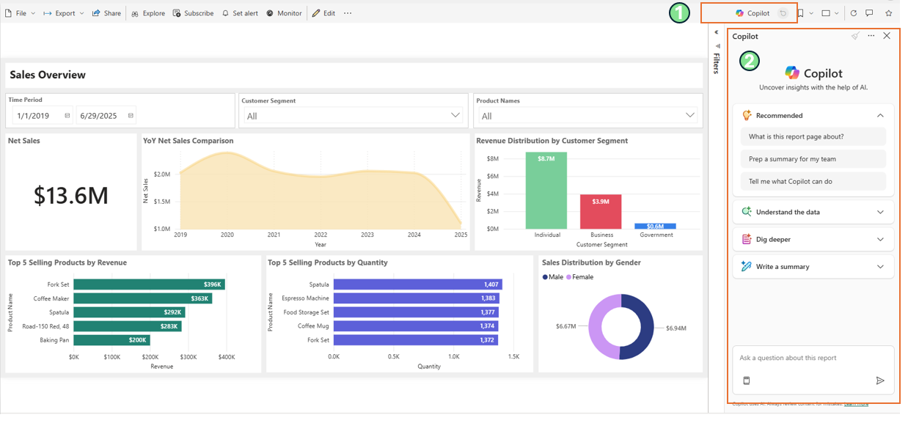
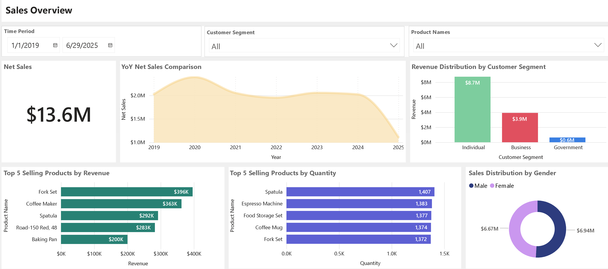

# Copilot for Power BI Guide

This guide provides an overview of Copilot for Power BI and how to use it with the **Unified data foundation with Fabric solution accelerator** sales dashboard report.

---

## Overview

Copilot for Power BI is a built-in AI assistant that enables you to interact with your Power BI reports using natural language. With Copilot, you can ask questions about your data, get insights, and explore visualizations without needing to manually navigate through reports or write queries.

### Key Capabilities

- **Natural Language Queries**: Ask questions about your data in plain business language
- **Automatic Insights**: Get AI-generated summaries and highlights from your reports
- **Visual Exploration**: Copilot can help you understand and interpret existing visualizations
- **Quick Answers**: Get instant responses to common business questions

### Prerequisites

To use Copilot for Power BI with this solution accelerator:

1. **Deployed Reports**: Complete the [Power BI Deployment Guide](./DeploymentGuidePowerBI.md) to deploy the sales dashboard
2. **Copilot Enabled**: Copilot must be enabled in your tenant admin settings
3. **(Optional) Enable Q&A on Semantic Model**: By default, Copilot answers questions based on the visuals displayed on the current report page. To query the entire semantic model beyond visible report data, see [Enable Q&A for the Semantic Model](./EnableQAForSemanticModel.md)

For more information on enabling Copilot, see [Microsoft's official documentation](https://learn.microsoft.com/en-us/power-bi/create-reports/copilot-introduction).

---

## Using Copilot with Sales Dashboard

Once the Power BI reports are deployed and connected to your `maag_gold` lakehouse, you can access Copilot directly from the report view.

### How to Access Copilot

1. Open the **Sales Dashboard** report in your Fabric workspace
2. Click on the **Copilot** button in the report toolbar (upper right)
3. The Copilot pane will open on the right side of your screen
4. Start asking questions about your sales data

   
   
   On right side of below image, you can see example interactions with Copilot for PBI. 
   
   

---

## Sample Questions

Here are example questions you can ask Copilot based on the visuals displayed in the report:

| Topic | Sample Question | What You'll Learn |
|-------|-----------------|-------------------|
| Revenue Trends by Year | "Show total revenue by year for last 5 years" | Yearly revenue totals to identify growth trends and year-over-year performance |
| Top Selling Products | "What is the revenue generated by Top 5 Selling products by quantity?" | Products with highest sales volume and their corresponding revenue contribution |

---

## Troubleshooting Copilot Responses

If Copilot is not providing useful responses, try these tips:

| Issue | Solution |
| ------- | ---------- |
| "I can't answer that" | Simplify your question. Use shorter, more direct phrases |
| Incorrect data returned | Be more specific about the measure (revenue, count, average) |
| Vague answers | Reference specific fields like "order total", "product name", or "order date" |

### Tips for Better Questions

1. **Be specific about the measure**: Instead of "show me sales", ask "what is the total order amount"
2. **Use field names from the report**: Reference visible column names like "PaymentMethod", "OrderStatus", "CategoryName"
3. **Keep it simple**: Start with basic questions before asking complex ones
4. **One question at a time**: Avoid compound questions with multiple parts
5. **Use filter terms**: "completed orders", "in 2024", "for bikes"

---

## Additional Resources

- [Overview of Copilot for Power BI](https://learn.microsoft.com/en-us/power-bi/create-reports/copilot-introduction)
- [Copilot for Power BI FAQ](https://learn.microsoft.com/en-us/power-bi/create-reports/copilot-faq)
- [Enable Q&A for the Semantic Model](./EnableQAForSemanticModel.md) - Query the entire semantic model
- [Fabric Data Agent Guide](./FabricDataAgentGuide.md) - For querying your lakehouse data directly

---
