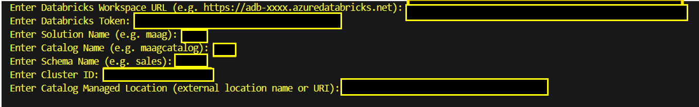
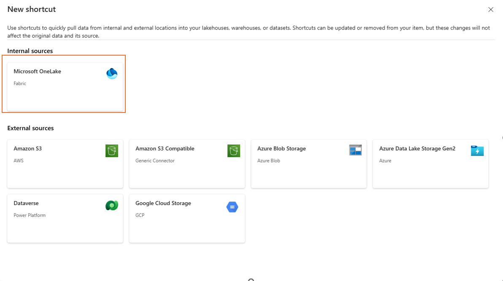
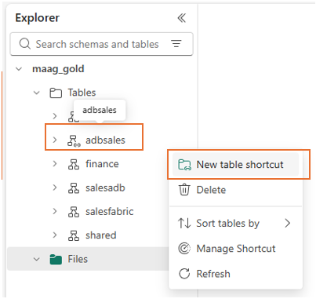

# Deployment Guide for Azure Databricks Lakehouse

This guide describes how to deploy the **Unified data foundation with Fabric solution accelerator** - Databricks components including notebooks, sample data, Unity Catalog, and workspace structure.

---

## Prerequisites


If you have not deployed Option 1, deploy the medallion architecture with PowerBI dashboard by following the instructions [Medallion Architecture with PBI Dashboard Deployment Guide](./DeploymentGuideFabric.md) and follow the [Setup Guide for Databricks](./SetupDatabricks.md). The Setup guide for Databricks contains important steps you must complete before running the deployment scripts.

**Required Tools for deployment**

- [Python 3.9+](https://www.python.org/downloads/) - for running deployment scripts
- [Git](https://git-scm.com/downloads) - for cloning the repository

---

### Important Note for PowerShell Users

If you encounter issues running PowerShell scripts due to execution policy restrictions, temporarily adjust the `ExecutionPolicy`:

```powershell
Set-ExecutionPolicy -Scope Process -ExecutionPolicy Bypass
```

This allows scripts to run for the current session without permanently changing system policy.

---


## Deployment Options

Choose from the following deployment environments based on your preference and setup:

| [](https://codespaces.new/microsoft/your-repo-name) | [](https://portal.azure.com/#cloudshell/) | Local Environment |
|---|---|---|

<details>
  <summary><b>Deploy in GitHub Codespaces</b></summary>

### GitHub Codespaces

You can run this solution using GitHub Codespaces. The button will open a web-based VS Code instance in your browser:

1. Open the solution accelerator (this may take several minutes):

    [](https://codespaces.new/microsoft/your-repo-name)

2. Accept the default values on the create Codespaces page.
3. Open a terminal window if it is not already open.
4. Continue with the [Databricks Items Deployment](#databricks-items-deployment) steps.

</details>

<details>
  <summary><b>Deploy in Azure Cloud Shell</b></summary>

### Azure Cloud Shell

You can run the Databricks deployment directly from Azure Cloud Shell without needing to install anything locally:

1. Open [Azure Cloud Shell](https://portal.azure.com/#cloudshell/) in your browser.

2. Clone the repository:
   ```bash
   git clone <repository-url>
   cd MaagDataFoundationForAI
   ```

3. Navigate to the deployment directory:
   ```bash
   cd infra/scripts/databricks
   ```

4. Continue with the [Databricks Items Deployment](#databricks-items-deployment) steps using the bash script.

</details>

<details>
  <summary><b>Deploy in Local Environment</b></summary>

### Local Environment

If you're deploying from your local machine, ensure you have the required tools installed:

1. **Required tools:**
   - [Azure CLI](https://learn.microsoft.com/en-us/cli/azure/install-azure-cli)
   - [Python 3.9+](https://www.python.org/downloads/)
   - [Git](https://git-scm.com/downloads)

2. **Clone the repository:**
   ```shell
   git clone <repository-url>
   cd MaagDataFoundationForAI
   ```

3. Continue with the [Databricks Items Deployment](#databricks-items-deployment) steps.

</details>


## Overview

The Databricks deployment script automates the following:

- **Workspace Folder Structure**: Creates organized folders in the Databricks workspace for all solution notebooks (under `/Shared/<solution>`).
- **Notebook Upload & Normalization**: Uploads all notebooks from the repo to required folder
- **Sample Data Upload**: Uploads all CSV sample data files to a DBFS folder for the solution (e.g., `dbfs:/FileStore/tables/<solution>`).
- **Unity Catalog & Schema Creation**: Creates the specified Unity Catalog and schema if they do not exist, using explicit arguments for catalog name and managed location.
- **Automated Orchestration**: runs the orchestrator notebook (`run_bronze_to_adb.ipynb`) on the specified cluster to kick off initial data pipeline execution.


---

## Databricks Items Deployment

### 1. Workspace Setup

Ensure you have an Azure Databricks workspace available and that you have completed the steps in [Setup Guide for Databricks](./SetupDatabricks.md) to obtain the values listed below. 

Required values (collect these before running the script):

1. Workspace URL (e.g. https://adb-xxxx.azuredatabricks.net)
2. Personal Access Token (PAT)
3. Databricks Cluster ID 
4. Catalog Managed Location (external location name or URI)

### 2. Navigate to Deployment Directory

```bash
cd infra/scripts/databricks
```

### 3. Run Deployment Script

Choose the appropriate script for your platform:

#### For Linux/macOS/Cloud Shell (Bash)

```bash
# Make the script executable
chmod +x provision_databricks_items.sh

# Run the deployment
./provision_databricks_items.sh 
```

#### For Windows Local (PowerShell)

```powershell
# Run the PowerShell script
.\provision_databricks_items.ps1 
```

#### For GitHub Codespaces

```bash
# Codespaces comes with Python and Azure CLI pre-installed
# Navigate to the databricks deployment directory
cd infra/scripts/databricks

# Make the script executable
chmod +x provision_databricks_items.sh

# Run the deployment
./provision_databricks_items.sh
```

Once you start the script, it will prompt you for required arguments such as Workspace URL, Personal Access Token, Cluster ID, Solution name, Catalog name,Schema name, and Managed Location. Provide valid values for each prompt to ensure a successful deployment.
 

> **Note:**  
> Databricks **catalog** and **schema** names must only contain:  
> - Uppercase letters: `A–Z`  
> - Lowercase letters: `a–z`  
> - Digits: `0–9`  
> - Underscore `_`  
>
> ⚠️ Hyphens (`-`), spaces, and other special characters are **not allowed**.
> 


### 4. Monitor Deployment Progress
As the deployment script runs, you’ll see progress messages for each step:

1. **Environment Setup**: Installs Python dependencies.
2. **Folder Creation**: Sets up workspace folders.
3. **Catalog & Schema**: Ensures Unity Catalog and schema exist.
4. **Sample Data Upload**: Uploads CSV files to DBFS.
5. **Notebook Upload**: Uploads and configures notebooks.
6. **Initial Processing**: Runs the orchestrator notebook (if cluster specified).

Check the terminal for success or error messages. See Troubleshooting if issues occur.

---

## What Gets Created

- **Workspace folders**: `/Shared/<solution>/`
- **DBFS data**: `/FileStore/tables/<solution>/` (sample CSVs)
- **Notebooks**: Orchestration, transformation, data management, and schema definition

> *Note: Some logical folders (e.g., `bronze_to_silver/`) are not physically created by the script.*


---


## Mirroring Databricks Catalog in Fabric

After Databricks deployment, you can mirror the Unity Catalog in Microsoft Fabric:

1. Open the Fabric / Power BI portal (https://powerbi.com) and sign in to the target Fabric workspace.
2. Click **+ New** → **Mirrored Azure Databricks catalog**.
    
3. Authenticate using the previously created connection, then select the catalog, schemas, and tables you want to mirror.
  
 4. Review and create the mirrored item. Monitor sync status.

---

## Creating Shortcuts in Fabric Lakehouse

You can expose Databricks tables as **shortcuts** in a Fabric Lakehouse:

**Schema Shortcut**


1. Open your **Fabric workspace**.
2. Navigate to the **Lakehouse** (e.g. maag_gold) where you want to create the shortcut.
3. In the **Explorer pane**, right-click on **Tables** (or use the `...` menu).
4. Select **New schema shortcut**.

   
6. Choose the source: **Mirrored Catalog**→ **Microsoft OneLake**.
   
   
7. Enter the **connection details** and select the target **schema**.
   
8. Name the shortcut (e.g. adbSales).
9. Click **Create**.

Once the schema shortcut is created, you can proceed to create **table shortcuts** within it.

**Table shortcuts**

1. Open the Fabric workspace and navigate to the Lakehouse (e.g., `maag_gold`).

2. In the Lakehouse explorer, go to the desired schema (e.g., `adbsales`).

    
3. Right click and select **New table shortcut** → **Mirrored Catalog**→ **Microsoft OneLake**.

    

4. Authenticate and browse to the table you want to shortcut.

    

5. Name the shortcut (e.g., `adb_sales_order`).

6. Finish the wizard and validate the shortcut.
7. Repeat above steps for each table.

---

## Post-Setup Verification

After creating shortcuts, verify data access in Fabric:

1. Open the Lakehouse in Fabric and click **SQL endpoint**(top right).
2. Run queries like:
   ```sql
   SELECT COUNT(*) FROM <table1>;
   SELECT COUNT(*) FROM <table2>;
   SELECT COUNT(*) FROM <table2>;
   ```

---

## Troubleshooting

| Issue | Likely Cause | Action |
|-------|--------------|--------|
| Shortcut creation fails | External Data Access disabled | Enable in ADB workspace settings, retry. |
| Zero rows after load | Wrong CSV DBFS path | Re-check path |
| Table not found in SHOW TABLES | Schema mismatch | Ensure schema/catalog name in model notebook matches validation SQL. |
| Duplicate table errors | Existing stale Delta tables | Run drop_all_tables or adjust create logic. |
| Mirror sync error | Permissions/region limitations | Verify user privileges & region support for mirroring. |

---

<br/>

You’re done! Your Databricks workspace is now set up with the MAAG Data Foundation Solution Accelerator. Explore the deployed notebooks and sample data in your Databricks workspace
