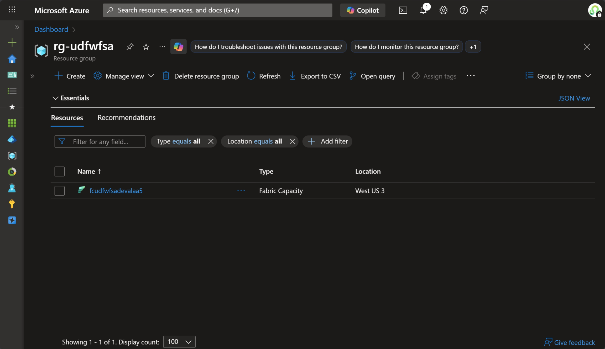
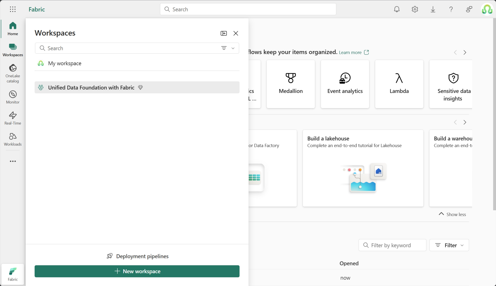
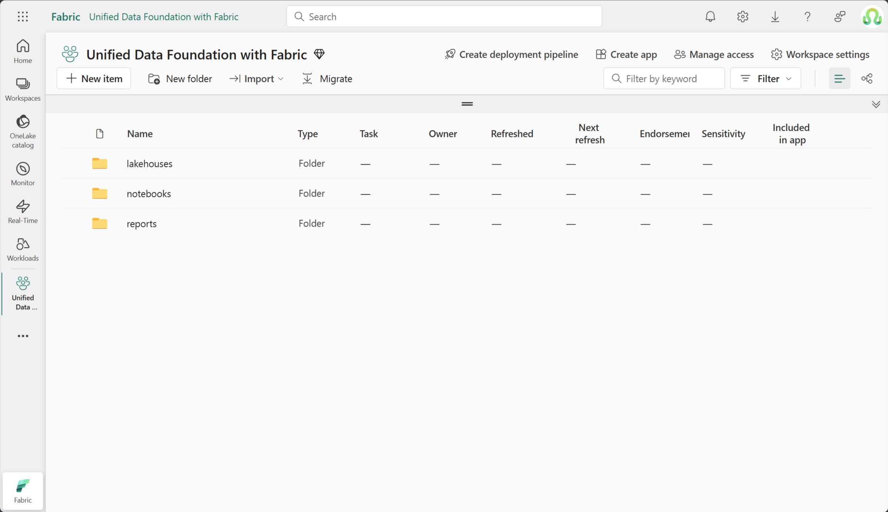
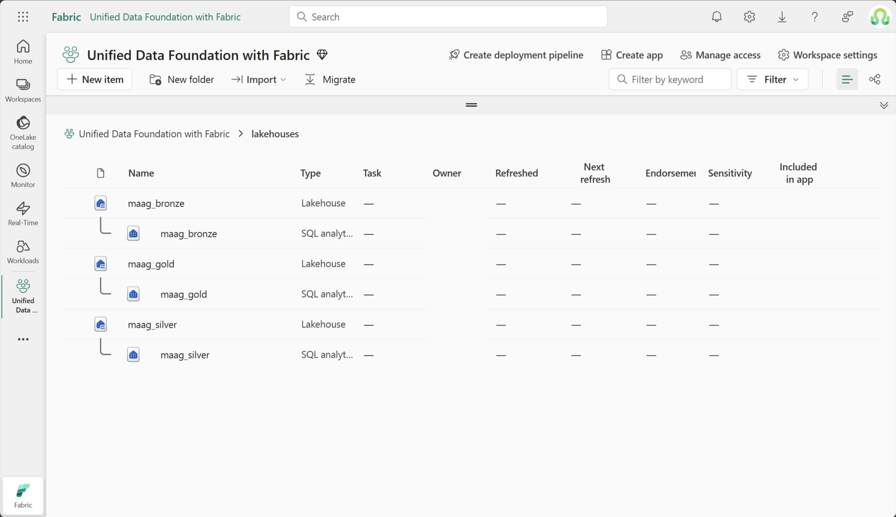
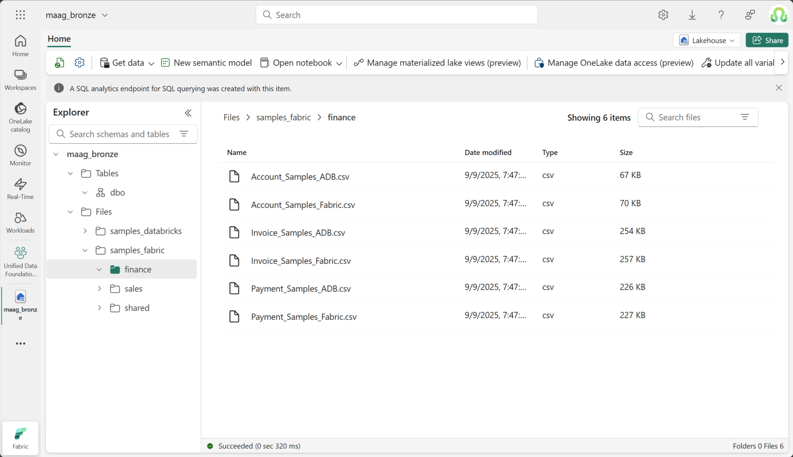
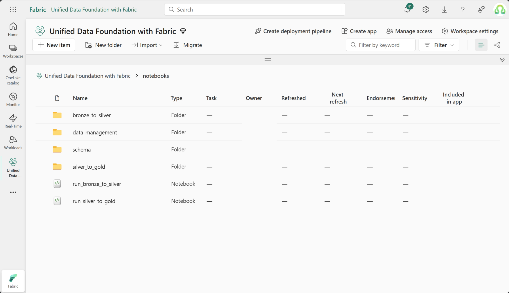
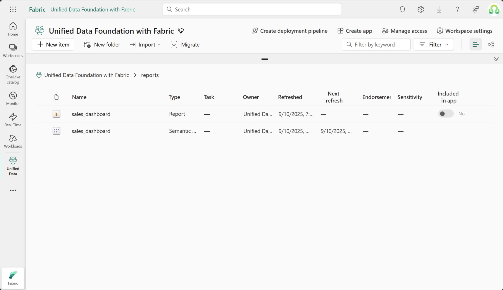
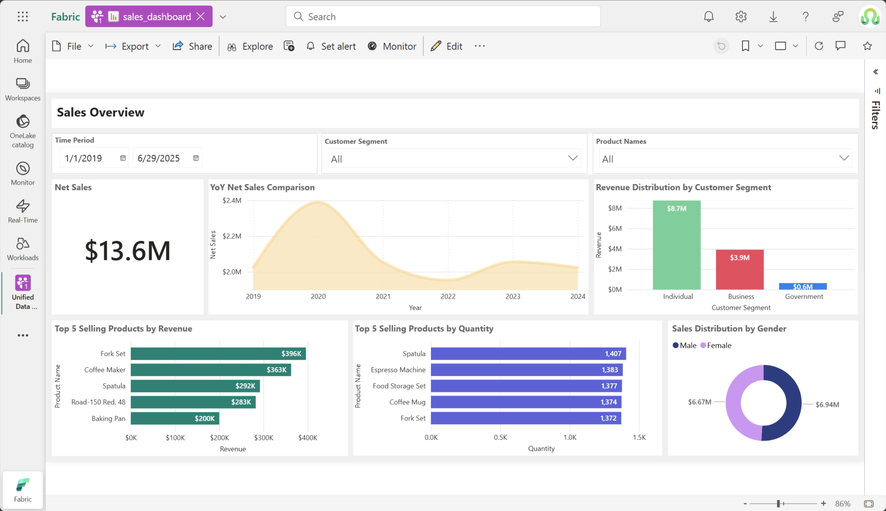

# Deployment Guide for Medallion Architecture and PBI in Fabric

Deploy the **Unified Data Foundation with Fabric** solution accelerator using Azure Developer CLI - get a complete data platform with medallion architecture in minutes.

---

## 📖 Quick Navigation

This guide helps you deploy the Unified Data Foundation with Fabric solution accelerator using Azure Developer CLI.

### Getting Started
- **New to this solution?** Start with [Deployment Overview](#-deployment-overview) → [Prerequisites](#-prerequisites) → [Quick Start](#-quick-start)
- **Ready to deploy?** Jump directly to [Quick Start](#-quick-start)
- **Need customization?** See [Advanced Configuration Options](#advanced-configuration-options)

### Key Sections
| Section | Description |
|---------|-------------|
| [Deployment Overview](#-deployment-overview) | Overview of deployed resources and architecture |
| [Prerequisites](#-prerequisites) | Required permissions, tools, and setup |
| [Quick Start](#-quick-start) | One-command deployment instructions |
| [Deployment Options](#-deployment-options) | Local, cloud, and CI/CD deployment methods |
| [Deployment Results](#-deployment-results) | Expected outcomes and verification steps |
| [Advanced Configuration Options](#advanced-configuration-options) | Optional customization parameters |
| [Known Limitations](#-known-limitations) | Important constraints to review |
| [Environment Cleanup](#-environment-cleanup) | How to remove deployed resources |
| [Additional Resources](#-additional-resources) | Support and further reading |

### Alternative Deployment Methods
This guide focuses on automated deployment using Azure Developer CLI. For manual deployment or existing Fabric capacity integration, refer to the [Manual Deployment Guide](./DeploymentGuideFabricManual.md).

---


## 📋 Prerequisites

To deploy this solution, ensure you have the following tools and permissions.

### Software Requirements
You need these tools installed to run the deployment commands.

| Tool | Version | Purpose | Download |
|------|---------|---------|----------|
| **Azure Developer CLI** | Latest | Orchestrates deployment | [Install azd](https://learn.microsoft.com/azure/developer/azure-developer-cli/install-azd) |
| **Azure CLI** | Latest | Authentication | [Install az](https://learn.microsoft.com/cli/azure/install-azure-cli) |
| **Python** | 3.9+ | Fabric configuration scripts | [Install Python](https://www.python.org/downloads/) |

> **💡 Tip**: You can skip installing tools by using [Azure Cloud Shell](https://shell.azure.com) or GitHub Codespaces.

### Permissions
Your deployment identity (User or Service Principal) requires the following permissions.

#### 🔐 Azure Permissions
- [ ] **Resource Group Access**: Ensure your deployment identity has permissions on target Resource Group to deploy Bicep templates and create Azure resources using appropriate [Azure RBAC built-in roles](https://learn.microsoft.com/azure/role-based-access-control/built-in-roles) (e.g. has [Contributor](https://learn.microsoft.com/azure/role-based-access-control/built-in-roles#contributor) or [Owner](https://learn.microsoft.com/azure/role-based-access-control/built-in-roles#owner)) or appropriate [Azure RBAC custom role](https://learn.microsoft.com/azure/role-based-access-control/custom-roles) with necessary permissions
- [ ] **`Microsoft.Fabric` Resource Provider Access**: Verify your Azure Subscription has [Microsoft.Fabric resource provider](https://learn.microsoft.com/azure/azure-resource-manager/management/azure-services-resource-providers) enabled and your deployment identity has permissions on Resource Group to create [Microsoft Fabric capacity resource](https://learn.microsoft.com/azure/templates/microsoft.fabric/capacities?pivots=deployment-language-bicep)

#### 🔗 API Permissions
- [ ] **Microsoft Graph API - `User.Read`**: Delegated permission to read signed-in user profile information using [Microsoft Graph User permissions](https://learn.microsoft.com/graph/permissions-reference#user-permissions)
- [ ] **Microsoft Graph API - `openid`**: Delegated permission for sign in and user profile authentication using [OpenID Connect scopes](https://learn.microsoft.com/entra/identity-platform/scopes-oidc)
- [ ] **Fabric REST API - Workspace Management**: Access to create and manage Fabric workspaces for workspace structure deployment using [Fabric workspace APIs](https://learn.microsoft.com/rest/api/fabric/core/workspaces)
- [ ] **Fabric REST API - Item Creation**: Access to create lakehouses, notebooks, and reports for Fabric content deployment using [Fabric item APIs](https://learn.microsoft.com/rest/api/fabric/core/items)
- [ ] **Fabric REST API - Content Upload**: Access to upload files and manage workspace content for sample data and notebook deployment using [Fabric REST API scopes](https://learn.microsoft.com/rest/api/fabric/articles/scopes)
- [ ] **Power BI API - `Tenant.Read.All`**: Delegated permission to read organization's Power BI tenant information using [Power BI REST API permissions](https://learn.microsoft.com/rest/api/power-bi/#scopes)

#### ✅ Quick Check
Run this command to verify your tools are ready:

```bash
# Check Azure CLI
az --version
az account show

# Check Azure Developer CLI
azd version

# Check Python
python --version
```

## 🚀 Quick Start

**One-command deployment** - Deploy everything with Azure Developer CLI ([prerequisites required](#-prerequisites)):

```bash
# Clone and navigate to repository
git clone https://github.com/microsoft/unified-data-foundation-with-fabric-solution-accelerator.git
cd unified-data-foundation-with-fabric-solution-accelerator

# Authenticate (required)
az login
azd auth login

# Optional: Customize workspace name
azd env set AZURE_FABRIC_WORKSPACE_NAME "My Analytics Platform"

# Deploy everything
azd up
```

During deployment, you'll specify:
- **Environment name** (e.g., "udfwf-dev"). This will be used to build the name of the deployed Azure resources.
- **Azure subscription**.
- **Azure resource group**.

**What you get**: Complete medallion architecture with Fabric capacity, lakhouses (Bronze/Silver/Gold), notebooks, sample data, and Power BI reports.

> **💡 Alternative Deployment Option**
> 
> This guide uses Azure Developer CLI for automated deployment. If you prefer more granular control or have an existing Fabric capacity, see the [Manual Deployment Guide](./DeploymentGuideFabricManual.md).

### Next Steps
- **First deployment**: Follow the commands above - they work in [multiple environments](#-deployment-options)
- **Need different setup**: See [deployment environment options](#-deployment-options) (Cloud Shell, Codespaces, etc.)
- **Understand the process**: Review [deployment overview](#-deployment-overview) for technical details
- **See what's created**: Check [deployment results](#-deployment-results) for detailed component overview with screenshots
- **Want to customize**: Explore [configuration options](#advanced-configuration-options) for naming, capacity sizing, and admin setup
- **Limitations**: Review [known limitations](#-known-limitations) for common issues and workarounds
- **Remove environment**: Use [environment cleanup](#-environment-cleanup) to completely remove your deployment

---

## 🔍 Deployment Overview

This solution accelerator uses a **two-phase deployment approach** to provision a complete data platform. The process is fully automated, idempotent, and safe to re-run.

### 1️⃣ Phase 1: Infrastructure (Azure)
*Powered by Bicep & Azure Resource Manager*

This phase creates the physical resources in your Azure subscription.
- **Resource Group**: A container for your resources.
- **Fabric Capacity**: The compute engine (F SKU) that powers your data workloads.
- **Managed Identity**: The identity used for secure automation.

### 2️⃣ Phase 2: Data Platform (Fabric)
*Powered by Python & Fabric REST APIs*

This phase configures the logical architecture inside Microsoft Fabric.
- **Workspace**: Creates or configures the workspace on your Capacity.
- **Lakehouses**: Deploys the Medallion Architecture (`Bronze` → `Silver` → `Gold`).
- **Notebooks**: Uploads 40+ notebooks for data processing and orchestration.
- **Sample Data**: Ingests sample datasets (Finance, Sales) into the Bronze layer.
- **Power BI**: Deploys pre-built reports and dashboards.

### 🔄 Idempotency & Re-runs
The deployment is designed to be **safe to re-run**. If you run `azd up` again:
- **Infrastructure**: Only updates settings if they have changed (e.g., resizing Capacity).
- **Workspace**: Detects existing workspace and skips creation.
- **Content**: 
  - *Notebooks/Reports*: Updated to the latest version (overwrites changes).
  - *Data*: Preserved (sample data is re-uploaded if missing).
  - *Admins*: New admins are added; existing ones remain.

The deployment orchestration coordinates both phases, passing deployment parameters and ensuring proper sequencing. See [deployment options](#-deployment-options) for different ways to run this deployment based on your preferred environment.

---

## 💻 Deployment Options

Choose your deployment environment based on your workflow and requirements. All options use the same [Quick Start commands](#-quick-start) with environment-specific setup.

| Environment | Best For | Setup Required | Notes |
|-------------|----------|----------------|-------|
| **[Local Machine](#1-local-machine)** | Full development control | Install [software requirements](#software-requirements) | Most flexible, requires local setup |
| **[Azure Cloud Shell](#2-azure-cloud-shell)** | Zero setup | Just a web browser | Pre-configured tools, session timeouts |
| **[GitHub Codespaces](#3-github-codespaces)** | Team consistency | GitHub account | Cloud development environment |
| **[Dev Container](#4-vs-code-dev-container)** | Standardized tooling | Docker Desktop + VS Code | Containerized consistency |
| **[GitHub Actions](#5-github-actions-cicd)** | Automated CI/CD | Service principal setup | Production deployments |

### 1. Local Machine
Deploy with full control over your development environment.

**Setup requirements**: Install the [software requirements](#software-requirements)

**Deployment**: Use the standard [Quick Start commands](#-quick-start)

### 2. Azure Cloud Shell
Deploy from Azure's browser-based terminal with zero local installation.

**Setup**: Open [Azure Cloud Shell](https://shell.azure.com) and install Azure Developer CLI:
```bash
curl -fsSL https://aka.ms/install-azd.sh | bash && exec bash
```

**Deployment**: Run the [Quick Start commands](#-quick-start) (Azure CLI pre-authenticated)

### 3. GitHub Codespaces  
Deploy from a cloud development environment with pre-configured tools.

**Setup**: 
1. Go to the [repository](https://github.com/microsoft/unified-data-foundation-with-fabric-solution-accelerator)
2. Click **Code** → **Codespaces** → **Create codespace**

**Deployment**: Install azd and run [Quick Start commands](#-quick-start) with device authentication:
```bash
# Install azd if needed
curl -fsSL https://aka.ms/install-azd.sh | bash && exec bash

# Use device code authentication  
az login --use-device-code
azd auth login --use-device-code

# Continue with Quick Start deployment commands
```

### 4. VS Code Dev Container
Deploy from a containerized environment for team consistency.

**Setup**: 
1. Install [Docker Desktop](https://www.docker.com/products/docker-desktop) and [Dev Containers extension](https://marketplace.visualstudio.com/items?itemName=ms-vscode-remote.remote-containers)
2. Clone repository and open in VS Code
3. Reopen in container when prompted

**Deployment**: All tools pre-installed - run [Quick Start commands](#-quick-start) directly

### 5. GitHub Actions (CI/CD)
Automated deployment using the included [workflow](../.github/workflows/azure-dev.yml).

**Setup**: Configure [repository variables](https://docs.github.com/en/actions/learn-github-actions/variables) and set up [service principal with federated credentials](https://learn.microsoft.com/azure/developer/github/connect-from-azure)

**Triggers**: Push to main branch or manual workflow dispatch

---

## ✅ Deployment Results

After successful deployment, you'll have a complete data platform implementing medallion architecture.

### Azure Infrastructure

| Resource | Purpose |
|----------|---------|
| **[Fabric Capacity](https://learn.microsoft.com/fabric/admin/capacity-settings?tabs=power-bi-premium)** | Dedicated compute for Fabric workloads |
| **[Managed Identity](https://learn.microsoft.com/entra/identity/managed-identities-azure-resources/overview)** | Secure authentication for automated operations |



### Fabric Components

#### Fabric Workspace

Workspace created with the specified or default name.



#### Folder Structure

```
your-workspace/
├── lakehouses/          # Bronze, Silver, Gold lakehouses
├── notebooks/           # Data transformation pipelines
│   ├── bronze_to_silver/
│   ├── silver_to_gold/
│   ├── data_management/
│   └── schema/
└── reports/            # Power BI dashboards
```



#### Lakehouses

| Name | Purpose | Schema Support |
|------|---------|----------------|
| `maag_bronze` | Raw data ingestion | Enabled |
| `maag_silver` | Cleaned, standardized data | Enabled |
| `maag_gold` | Business-ready aggregated data | Enabled |



#### Sample Data

The solution includes sample data for:
- **Finance data**: accounts, invoices, payments
- **Sales data**: orders, order lines, payments from multiple sources
- **Shared reference data**: customers, products, locations, categories



#### Notebooks

**Automation Components**:
- **Orchestration notebooks**: `run_bronze_to_silver`, `run_silver_to_gold`
- **Transformation notebooks**: Domain-specific data processing for each entity
- **Management utilities**: Table operations, schema definitions, troubleshooting tools



#### Power BI Reports

Any `.pbix` files found in the `reports/` directory will be automatically deployed to the workspace's reports folder. The deployment process:
- Scans recursively through the reports directory
- Uploads each Power BI report with conflict resolution (Create or Overwrite)
- Assigns reports to the appropriate folder within the workspace
- Provides deployment tracking and verification

**PowerBI files**



**PowerBI Dashboard**



---


## Advanced Configuration Options

The solution accelerator provides flexible configuration options to customize your deployment. Parameters can be configured through **Azure Developer CLI environment variables** (`azd env set`) for local deployments or through **GitHub repository variables** for CI/CD deployments.

> **📁 Configuration Files Reference:**
> - Infrastructure: [`infra/main.bicep`](../infra/main.bicep) - Azure resource definitions
> - Deployment orchestration: [`azure.yaml`](../azure.yaml) - AZD project configuration  
> - CI/CD workflow: [`.github/workflows/azure-dev.yml`](../.github/workflows/azure-dev.yml) - GitHub Actions pipeline
> - Fabric deployment: [`infra/scripts/fabric/create_fabric_items.py`](../infra/scripts/fabric/create_fabric_items.py) - Fabric workspace setup

### 🏗️ Infrastructure Configuration

Configure the Azure infrastructure components through Bicep template parameters defined in [`main.bicep`](../infra/main.bicep).

<details>
<summary><strong>Azure Resources</strong></summary>

| Parameter | AZD Environment Variable | GitHub Actions Variable | Description | Default | Example |
|-----------|-------------------------|------------------------|-------------|---------|---------|
| **Solution Name** | `solutionName` | `AZURE_ENV_NAME` | Friendly name for the application/solution (3-20 chars) | `udfwfsa` | `mycompany-fabric` |
| **Location** | `AZURE_LOCATION` | `AZURE_LOCATION` | Azure region for resource deployment | Resource group location | `eastus`, `westus2`, `westeurope` |
| **Fabric Capacity SKU** | `skuName` | Not directly supported* | Fabric capacity tier and performance level | `F2` | `F4`, `F8`, `F16`, `F32`, `F64`, `F128`, `F256`, `F512`, `F1024`, `F2048` |
| **Enable Telemetry** | `enableTelemetry` | Not directly supported* | Enable/disable usage telemetry collection | `true` | `false` |

*_GitHub Actions can use additional parameters through Bicep parameter files or workflow modifications._

**Configuration Examples:**

<details>
<summary><strong>🖥️ Azure Developer CLI</strong></summary>

```bash
# Set environment variables (used by main.parameters.json)
azd env set AZURE_LOCATION "westeurope"
azd env set skuName "F8"
azd env set enableTelemetry false
azd up
```

</details>

<details>
<summary><strong>🚀 GitHub Actions</strong></summary>

Modify [`azure-dev.yml`](../.github/workflows/azure-dev.yml) Deploy Infrastructure step:

```yaml
- name: Deploy Infrastructure
  uses: azure/bicep-deploy@v2
  with:
    parameters: |
      {
        "solutionName": "${{ env.AZURE_ENV_NAME_DEV }}",
        "skuName": "F8",
        "enableTelemetry": false
      }
```

</details>

**Fabric Capacity SKU Selection Guide:**
- **F2-F4**: Development and testing environments
- **F8-F32**: Small to medium production workloads
- **F64-F256**: Large enterprise production workloads  
- **F512-F2048**: High-performance analytics and data science workloads

For detailed capacity planning, see [Fabric capacity planning](https://learn.microsoft.com/fabric/admin/capacity-planning).

</details>

### 🏢 Fabric Workspace Configuration

Customize the Fabric workspace setup and naming conventions. These parameters are used by the [`create_fabric_items.py`](../infra/scripts/fabric/create_fabric_items.py) script during post-provisioning.

<details>
<summary><strong>Workspace Settings</strong></summary>

| Parameter | AZD Environment Variable | GitHub Actions Variable | Description | Default | Example |
|-----------|-------------------------|------------------------|-------------|---------|---------|
| **Capacity Name** | `AZURE_FABRIC_CAPACITY_NAME` | Bicep output | Microsoft Fabric capacity name (auto-generated from deployment) | Generated from Bicep | `fc-udfwfsa-abc123` |
| **Workspace Name** | `AZURE_FABRIC_WORKSPACE_NAME` | `AZURE_FABRIC_WORKSPACE_NAME_DEV` | Custom name for the Fabric workspace | `Unified Data Foundation with Fabric workspace` | `"MyCompany Data Foundation"`, `"Analytics Platform - DEV"` |

**Configuration Examples:**

<details>
<summary><strong>🖥️ Azure Developer CLI</strong></summary>

```bash
azd env set AZURE_FABRIC_WORKSPACE_NAME "Analytics Platform - DEV"
azd up
```

</details>

<details>
<summary><strong>🚀 GitHub Actions</strong></summary>

Modify [`azure-dev.yml`](../.github/workflows/azure-dev.yml) environment variables:

```yaml
env:
  AZURE_FABRIC_WORKSPACE_NAME_DEV: "Analytics Platform (dev)"
```

</details>

**Workspace Naming Best Practices:**
- Use descriptive names that indicate purpose and environment
- Consider organizational naming conventions
- Include environment indicators for multi-environment deployments (Dev, Test, Prod)
- Avoid special characters that might cause conflicts with Fabric APIs

</details>

### 👥 Fabric Workspace Administrator Configuration

Manage workspace administrators and security permissions for the Fabric workspace. These parameters are processed by both the Bicep template ([`main.bicep`](../infra/main.bicep)) for capacity-level admins and the Fabric deployment script ([`create_fabric_items.py`](../infra/scripts/fabric/create_fabric_items.py)) for workspace-level admins.

<details>
<summary><strong>Admin Assignment Options</strong></summary>

| Parameter | AZD Environment Variable | GitHub Actions Support | Description | Format | Example |
|-----------|-------------------------|------------------------|-------------|--------|---------|
| **Fabric Admins** | `AZURE_FABRIC_ADMIN_MEMBERS` | Bicep output | List of administrators (UPNs and Service Principal IDs) | JSON array | `["user1@contoso.com", "12345678-1234-1234-1234-123456789012"]` |
| **Admins by Object ID** | `AZURE_FABRIC_ADMIN_MEMBERS_BY_OBJECT_ID` | Not directly supported* | List of object IDs with fallback user/service principal detection | JSON array | `["87654321-4321-4321-4321-210987654321"]` |

*_GitHub Actions workflow uses Bicep output for admin configuration. See examples below for customization._

**Administrator Types Supported:**
- **User Principal Names (UPNs)**: `user@domain.com` format for individual users
- **Service Principal IDs**: GUID format for application registrations  
- **Object IDs**: Direct Azure AD object identifiers with automatic type detection

**Configuration Examples:**

<details>
<summary><strong>🖥️ Azure Developer CLI</strong></summary>

```bash
azd env set AZURE_FABRIC_ADMIN_MEMBERS '["user@contoso.com", "sp-guid"]'
azd env set AZURE_FABRIC_ADMIN_MEMBERS_BY_OBJECT_ID '["object-id-guid"]'
azd up
```

</details>

<details>
<summary><strong>🚀 GitHub Actions</strong></summary>

**Option A**: Update [`main.parameters.json`](../infra/main.parameters.json):

```json
{
  "parameters": {
    "solutionName": { "value": "${AZURE_ENV_NAME}" },
    "fabricAdminMembers": { "value": ["user@contoso.com"] }
  }
}
```

**Option B**: Override in workflow [`azure-dev.yml`](../.github/workflows/azure-dev.yml):

```yaml
- name: Deploy Infrastructure  
  uses: azure/bicep-deploy@v2
  with:
    parameters: |
      {
        "fabricAdminMembers": ["user@contoso.com", "sp-guid"]
      }
```

</details>

**Administrator Assignment Behavior:**
- **Automatic Default Admin**: The deployment identity (user or service principal) is automatically added as a Fabric capacity admin
- **Duplicate Detection**: Prevents adding the same principal multiple times
- **Fallback Logic**: Object ID method tries both User and ServicePrincipal types automatically
- **Graph API Resolution**: UPN method uses Microsoft Graph API for identity resolution

**Permission Requirements:**
Administrators configured through these parameters will have **Admin** role on the Fabric workspace, providing:
- Full workspace management capabilities
- Ability to manage workspace items (lakehouses, notebooks, reports)
- User and permission management within the workspace
- Workspace settings configuration

</details>

### 🐍 Python Environment Configuration Options

Configure deployment behavior and troubleshooting options. These parameters are handled by the PowerShell orchestration script ([`run_python_script_fabric.ps1`](../infra/scripts/utils/run_python_script_fabric.ps1)).

<details>
<summary><strong>Deployment Customization</strong></summary>

These options are primarily used for configuring the appropriate environment for each deployment process based on elements such as underlying operating system or specialized environments such as containerized deployments or GitHub-hosted runners.

| Parameter | PowerShell Switch | AZD Support | GitHub Actions Support | Description | Use Case |
|-----------|-------------------|-------------|------------------------|-------------|----------|
| **Skip Virtual Environment** | `-SkipPythonVirtualEnvironment` | Manual override | ✅ Used in workflow | Use system Python instead of virtual environment | System-wide Python management, containerized environments |
| **Skip Dependencies** | `-SkipPythonDependencies` | Manual override | ✅ Used in workflow | Skip installing Python packages (assume pre-installed) | Pre-configured environments, repeated deployments |
| **Skip Pip Upgrade** | `-SkipPipUpgrade` | Manual override | ✅ Used in workflow | Skip upgrading pip to latest version | Environments with controlled pip versions |

**Configuration Examples:**

<details>
<summary><strong>🖥️ Azure Developer CLI</strong></summary>

These parameters are automatically optimized in [`azure.yml`](../azure.yaml):

```yaml
hooks:
  postprovision:
    windows:
      shell: pwsh
      run: ./infra/scripts/utils/run_python_script_fabric.ps1
      interactive: true
      continueOnError: false
    posix:
      shell: pwsh
      run: ./infra/scripts/utils/run_python_script_fabric.ps1 -SkipPythonVirtualEnvironment
      interactive: true
      continueOnError: false
  predown:
    windows:
      shell: pwsh
      run: ./infra/scripts/utils/run_python_script_fabric_remove.ps1
      interactive: true
      continueOnError: false
    posix:
      shell: pwsh
      run: ./infra/scripts/utils/run_python_script_fabric_remove.ps1 -SkipPythonVirtualEnvironment
      interactive: true
      continueOnError: false
```

</details>

<details>
<summary><strong>🚀 GitHub Actions</strong></summary>

These parameters are automatically optimized in [`azure-dev.yml`](../.github/workflows/azure-dev.yml):

```yaml
- name: Run Fabric Provisioning Script
  run: |
    pwsh ./run_python_script_fabric.ps1 \
      -SkipPythonVirtualEnvironment \
      -SkipPythonDependencies \
      -SkipPipUpgrade
```

</details>

</details>

---

## ❗ Known Limitations

This section documents known limitations in the deployment process and their workarounds.

### 🔒 Power BI API Parameter Updates

**Issue**: Service Principals cannot update Power BI dataset parameters via API, resulting in HTTP 403 errors.

**Impact**: 
- During automated deployment, if deployment identity is a Service Principal or a Managed Identity, Power BI reports are deployed but dataset parameters (SQL endpoint connection strings) may not be automatically configured
- Reports may show connection errors until manually configured

**Technical Details**:
The [`create_fabric_items.py`](../infra/scripts/fabric/create_fabric_items.py) script handles this gracefully:

```python
try:
    powerbi_client.update_powerbi_dataset_parameters(dataset_id=dataset['id'], parameters=[
        {"name": "sqlEndpoint", "newValue": sql_endpoint},
        {"name": "database", "newValue": database_name}
    ])
    print(f"✅ Dataset parameters updated successfully for '{report_name}'")
except Exception as param_error:
    if "HTTP 403" in str(param_error):
        print(f"⚠️ WARNING: Cannot update dataset parameters automatically for '{report_name}'")
        print(f"    Reason: API access restricted for service principal: {str(param_error)}")
        print(f"    Manual action required:")
        print(f"📋 Continuing deployment without dataset parameter updates...")
```

**Workaround**: 
- The deployment continues successfully despite this limitation
- Follow the manual configuration steps in the [Power BI Deployment Guide](./DeploymentGuidePowerBI.md) to complete the report setup
- This typically involves updating the `sqlEndpoint` and `database` parameters in the Power BI service

---

### 👤 Graph API Principal (user or service principal) Lookup Limitations

**Issue**: The deployment identity may lack permissions to query user object IDs from Azure Active Directory via Microsoft Graph API.

**Impact**:
- When using `--fabricAdmins` with user principal names (UPNs), the script may fail to resolve user identities
- Service Principals may successfully create workspaces but fail to add human users as administrators
- This can result in workspaces that are only accessible to the deployment service principal

**Technical Details**:
The [`create_fabric_items.py`](../infra/scripts/fabric/create_fabric_items.py) script implements fallback logic:

```python
def detect_principal_type(admin_identifier, graph_client=None):
    try:
        # Use Graph API to resolve the principal
        principal_type, object_id, principal_data = graph_client.resolve_principal(admin_identifier)
        return principal_type, object_id, principal_data
    except GraphApiError as e:
        # Convert Graph API errors to ValueError for backward compatibility
        print(f"⚠️ WARNING: Graph API lookup failed for '{admin_identifier}': {str(e)}")
        # Fallback to original logic if Graph API is not available
        if is_valid_guid(admin_identifier):
            return "ServicePrincipal", admin_identifier, {"id": admin_identifier, "displayName": "Unknown"}
```

**Workarounds**:

1. **Use Object IDs Instead**: Configure administrators using the `--fabricAdminsByObjectId` parameter or `AZURE_FABRIC_ADMIN_MEMBERS_BY_OBJECT_ID` environment variable as described in the [advanced configuration options](#advanced-configuration-options):
   ```bash
   azd env set AZURE_FABRIC_ADMIN_MEMBERS_BY_OBJECT_ID '["87654321-4321-4321-4321-210987654321"]'
   ```
   
   The script automatically tries both User and ServicePrincipal types for object IDs:
   ```python
   for principal_type in ["User", "ServicePrincipal"]:
       # Try both User and ServicePrincipal types
   ```

2. **Post-Deployment Admin Assignment**: Use the dedicated admin management scripts:
   - [`add_fabric_workspace_admins.py`](../infra/scripts/fabric/add_fabric_workspace_admins.py) - Direct Python script for admin assignment
   - [`run_python_script_fabric_admins.ps1`](../infra/scripts/utils/run_python_script_fabric_admins.ps1) - PowerShell orchestrator script
   
   These scripts can add administrators to all available Fabric workspaces after initial deployment.

---

### 🔐 Fabric REST API Permission Issues

**Issue**: Service Principals may lack sufficient permissions to access Microsoft Fabric REST APIs.

**Impact**: 
- Deployment fails during workspace creation or management operations
- Graceful exit with clear guidance on permission requirements

**Technical Details**:
The [`create_fabric_items.py`](../infra/scripts/fabric/create_fabric_items.py) script provides specific error handling for authorization failures:

```python
except FabricApiError as e:
    if e.status_code == 401:
        print(f"⚠️ WARNING: Unauthorized access to Fabric APIs. Please review your Fabric permissions and Ensure you have proper Fabric licensing and permissions.")
        print("   📋 Check the following resources:")
        print("   • Fabric licenses: https://learn.microsoft.com/fabric/enterprise/licenses")
        print("   • Identity support: https://learn.microsoft.com/rest/api/fabric/articles/identity-support")
        print("   • Create Entra app with appropriate Fabric permissions: https://learn.microsoft.com/rest/api/fabric/articles/get-started/create-entra-app")
        sys.exit(0)  # Graceful exit with guidance
```

**Resolution**:
1. **Verify Fabric Licensing**: Ensure your organization has appropriate [Microsoft Fabric licenses](https://learn.microsoft.com/fabric/enterprise/licenses)
2. **Review Identity Configuration**: Follow the [Fabric Identity Support](https://learn.microsoft.com/rest/api/fabric/articles/identity-support) documentation
3. **Configure Service Principal**: If using a service principal, ensure it's properly configured following [Create Entra App](https://learn.microsoft.com/rest/api/fabric/articles/get-started/create-entra-app) guidance
4. **Check API Permissions**: Verify the deployment identity has the required Fabric REST API permissions as listed in the [prerequisites](#-prerequisites)

The script performs a graceful exit (`sys.exit(0)`) rather than failing abruptly, allowing you to resolve permissions and retry the deployment.

---

## 🧹 Environment Cleanup

When you no longer need your deployed environment, Azure Developer CLI provides a streamlined approach to completely remove all resources and clean up your Microsoft Fabric workspace.

### Complete Environment Removal

The `azd down` command orchestrates a complete environment cleanup process that:

1. **Removes Fabric Workspace**: Safely deletes the Microsoft Fabric workspace and all associated items
2. **Deprovisions Azure Resources**: Removes all Azure infrastructure components deployed via Bicep templates
3. **Preserves Local Environment**: Keeps your local development environment and configurations intact

**Quick cleanup command:**

```bash
# Navigate to your solution directory
cd unified-data-foundation-with-fabric-solution-accelerator

# Remove everything deployed by azd up
azd down
```

### Cleanup Process Details

Based on the [`azure.yaml`](../azure.yaml) configuration, the cleanup process follows these orchestrated steps:

#### Phase 1: Fabric Workspace Cleanup (predown hook)
Before removing Azure infrastructure, the cleanup process first handles the Microsoft Fabric workspace:

**Windows (PowerShell):**
```powershell
./infra/scripts/utils/run_python_script_fabric_remove.ps1
```

**Unix/Linux (PowerShell Core):**
```bash
./infra/scripts/utils/run_python_script_fabric_remove.ps1 -SkipPythonVirtualEnvironment
```

This orchestration script ([`run_python_script_fabric_remove.ps1`](../infra/scripts/utils/run_python_script_fabric_remove.ps1)) manages:
- **Python Environment Setup**: Creates or reuses Python virtual environment with required dependencies
- **Workspace Identification**: Locates the target workspace using environment variables or defaults
- **Safe Deletion**: Executes the Python removal script with proper error handling and user guidance

The core removal logic is handled by [`remove_fabric_workspace.py`](../infra/scripts/fabric/remove_fabric_workspace.py), which:
- **Workspace Lookup**: Finds the workspace by name or ID (defaults to "Unified Data Foundation with Fabric workspace")
- **Comprehensive Removal**: Deletes all workspace items including notebooks, lakehouses, and datasets
- **Confirmation Prompts**: Provides interactive confirmation to prevent accidental deletions
- **Error Handling**: Gracefully handles missing workspaces or permission issues

#### Phase 2: Azure Infrastructure Cleanup
After successful Fabric workspace removal, `azd down` proceeds to deprovision all Azure resources that were created through the [`main.bicep`](../infra/main.bicep) template, including:

- **Microsoft Fabric Capacity**: Dedicated compute resources
- **User-Assigned Managed Identity**: Secure authentication identity
- **Resource Group**: Complete resource group removal (if specified)

### Safety Features

The cleanup process includes several safety mechanisms:

- **Interactive Confirmation**: Prompts before deleting workspaces to prevent accidental removal
- **Graceful Error Handling**: Continues with infrastructure cleanup even if Fabric workspace removal fails
- **Detailed Logging**: Provides comprehensive output for troubleshooting and audit purposes
- **Non-Destructive Failures**: Missing workspaces or permission issues don't prevent infrastructure cleanup

---

## 📚 Additional Resources

- **Documentation**: [Microsoft Fabric](https://learn.microsoft.com/fabric/) | [Azure Developer CLI](https://learn.microsoft.com/azure/developer/azure-developer-cli/)
- **Guides**: [Power BI Deployment](./DeploymentGuidePowerBI.md) | [FAQs](./FAQs.md) 
- **Repository**: [Solution Accelerator](https://github.com/microsoft/unified-data-foundation-with-fabric-solution-accelerator)

For support, visit the [project repository](https://github.com/microsoft/unified-data-foundation-with-fabric-solution-accelerator) or engage with the Microsoft Fabric community.

---
