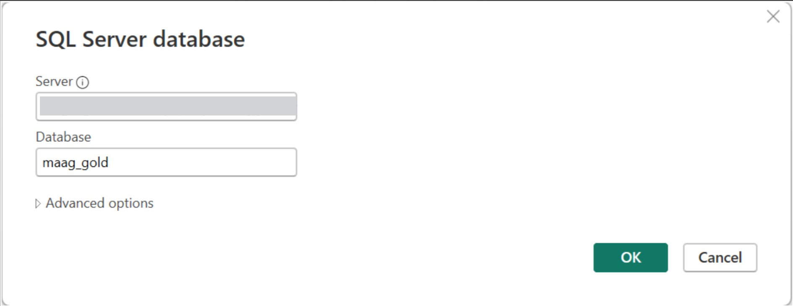
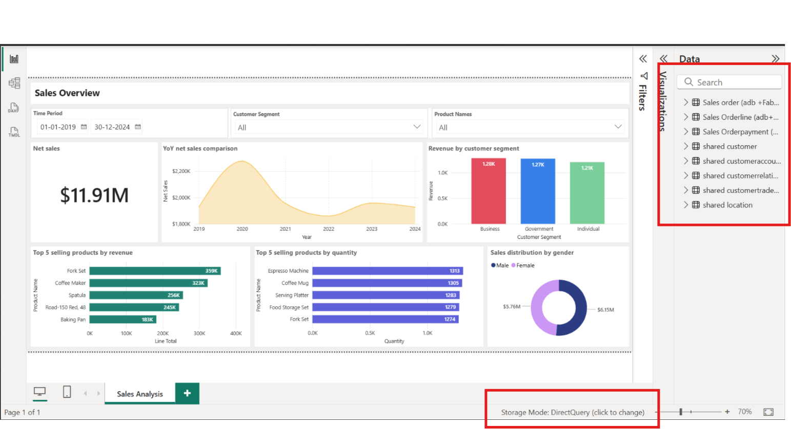
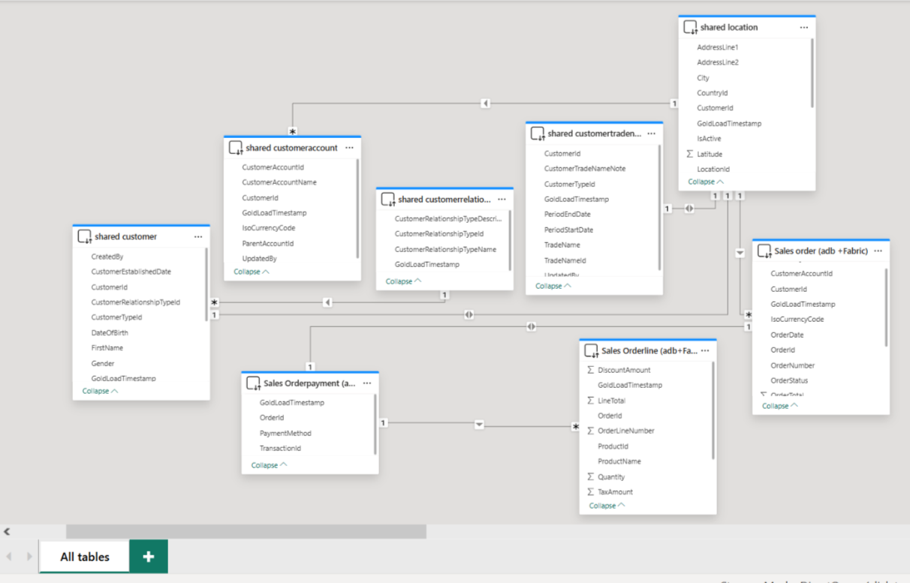

# Power BI Deployment Guide
 
This guide describes how to deploy the **Unified data foundation with Fabric solution accelerator** Power BI reports to Microsoft Fabric, using either a Power BI Template (.pbit) or a pre-built Power BI Report (.pbix).
 
---
 
## Prerequisites
Refer to the [Setup Guide for Fabric](./SetupFabric.md) and [Deployment Guide for Fabric](./DeploymentGuideFabric.md) to complete the required environment and account setup before proceeding.
 
---
 
## Deployment Options
 
You can deploy the Power BI report to Fabric using either of the following methods:
 
1. **Option 1: Configure and Publish Power BI Template (.pbit) using Power BI Desktop**
2. **Option 2: Use .pbix directly in Fabric and update data source parameters in the portal**
 
---
 
## Option 1: Configure and Publish Power BI Template (.pbit) using Power BI Desktop
 
This method uses the provided Power BI template to create a new report and semantic model, parameterized for your environment.
 
### Steps
 
1. **Get Source Connection**
   - In the Fabric workspace, open the **maag_gold** Lakehouse.
   - Select **SQL analytics endpoint** from top right 
   - Click on **Settings** gera icon on top left.
   - Get the **SQL endpoint** (SQL connection string) for use as parameters.

   
2. **Open and Connect Power BI Template**
   - Launch **Power BI Desktop**.
   - Go to **File > Open** and select **sales_dashboard.pbit** located in the [reports](./reports/sales_dashboard.pbit) folder.
   - When prompted, enter credential values:
     - **SQL endpoint**: `xxxx.datawarehouse.fabric.microsoft.com`
     - **Database**: `maag_gold` (same as Lakehouse name)
     - **Select Schema**: `shared`, `salesadb`, `salesfabric`, or `finance`
   - Click **Load**.
   - Ensure tables are loaded in **DirectQuery** mode (not Import)

    

    
 
3. **Review and Validate Data Model**
   - Confirm the necessary tables are available in Direct mode:
     - **Sales**: Order, Order Line, Order Payment
     - **Product**: Product, Product Category
     - **Customer**: Customer, Customer Account, Relationship Type, Trade Name, Location
     - **Finance**: Invoice, Payment, Account (if included)
   - In **Model view**, check relationship and cardinality view.

   
 
4. **Publish to Fabric and setup refresh**
   - In Power BI Desktop, select **Home > Publish**
   - In the Fabric portal, go to the published **Semantic Model > Settings**.
   - Under **Data source credentials**, set:
     - **Authentication**: Microsoft Account / OAuth (Fabric)
     - **Privacy level**: Organizational
   - Click **Refresh now** to validate connectivity.

 
---
 
## Option 2: Use .pbix directly in Fabric and update data source parameters in the portal**
 
This method allows you to upload a pre-built Power BI report file (`.pbix`) directly to Fabric and update connection parameters in the portal, without using Power BI Desktop.
 
### Steps to follow
 
1. **Use already uploaded .pbix file to Fabric workspace**
   - Open your Fabric workspace > Click **Upload > Browse this device**.
   - Select **sales_dashboard.pbix** located in the [reports](./reports/sales_dashboard.pbit) folder.
 
2. **Get the SQL Endpoint for Lakehouse**
   - In the Fabric workspace, open the **maag_gold** Lakehouse.
   - Click **Open SQL analytics endpoint** (top right) > click on **Settings** > copy the **SQL endpoint** (e.g., `xxxx.datawarehouse.fabric.microsoft.com`).
 
3. **Update Data Source Parameters in Fabric**
   - In the Fabric **maag_gold** workspace > go to **Semantic Model**.
   - Find your uploaded dataset (from the .pbix file).
   - Click the ellipsis (•••) next to the dataset > **Settings**.
  
   - Scroll to the **Parameters** section.
   - Update the parameter values:
     - **SQL endpoint**: `xxxx.datawarehouse.fabric.microsoft.com`
     - **DatabaseName**: `maag_gold` (same as Lakehouse name)
   
   - Click **Save** to apply the changes.
 
1. **Configure Credentials and Refresh**
   - In Dataset > Settings > Data source credentials:
     - Set authentication to Microsoft Account / OAuth (Fabric).
     - Set Privacy level to Organizational.
   - Click **Refresh now** to validate the connection.
 
---
 
## Troubleshooting
 
| Issue | Likely Cause | Action |
|-------|--------------|--------|
| Parameter Issues | Incorrect server, database, or schema values | Double-check all parameter values and ensure they match your environment |
| Data Refresh Failures | Invalid credentials or permissions | Confirm credentials, privacy level, and authentication method |
| Missing Tables | Gold layer tables not present or schema mismatch | Ensure tables exist in maag_gold and schema names are correct |
| Access Permissions | Insufficient permissions in Fabric or data source | Verify your user account has adequate permissions |
| Capacity/Performance | Resource limits or slow refresh | Consider scaling up Fabric capacity |
 
---