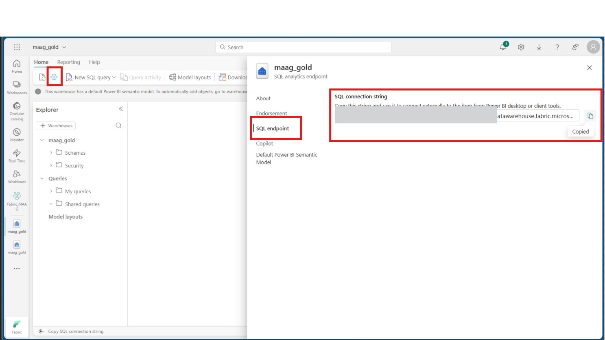
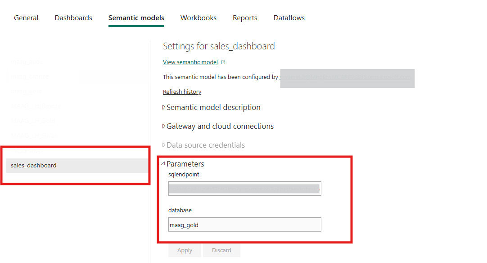

# Power BI Deployment Guide

This guide describes how to setup the **Unified data foundation with Fabric solution accelerator** Power BI reports to Microsoft Fabric.

---

## Prerequisites
If you have not done so, follow the instructions in [Medallion Architecture with PBI Dashboard Deployment Guide](./DeploymentGuideFabric.md) to deploy the required Fabric resources. 

---

## Obtain the SQL Endpoint 

1. In Microsoft Fabric, open the **`maag_gold` lakehouse**.  
2. Go to **Lakehouse settings** (*top left*) and locate the **SQL analytics endpoint**. 
   
   

3. Copy the **SQL connection string**. You will use this value to verify or configure connections in both automated and manual deployments.

---

## Deployment Options
You can deploy the Power BI report using either of the following approaches:

- **Option 1: Automated Report Deployment (PBIX)** – Recommended for most scenarios.  
- **Option 2: Manual Report Configuration (PBIT in Power BI Desktop)** – Advanced setup.  

---

## Option 1: Automated Report Deployment (PBIX)

### Steps

1. **PBIX Upload and Connection Setup**
   - The Fabric automation script uploads the `.pbix` file to the **`reports`** folder in your Fabric workspace.
   - The report is preconfigured to connect to the **`maag_gold` lakehouse** using the SQL endpoint.

2. **Verify Connection in Power BI**
   - In your Fabric workspace, open the **`reports`** folder and locate the semantic model linked to the report.  
   - Open the model’s **Settings** (three dots menu). 
       
   - If you’re not the owner, click **Take Over**. 
   
   - Under **Parameters**, check the value for **`sqlEndPoint`** and confirm that it matches the SQL endpoint obtained earlier.  
     

1. **Explore the Report**
   - Once verified, you can start exploring the report without additional configuration.  

> **Tip:** 
> 1. If you experience connection issues, see the [Troubleshooting](#troubleshooting) section.  
> 2. If the SQL endpoint does not match, follow the steps in Option 2 to manually configure the connection.

---

## Option 2: Manual Report Configuration (PBIT in Power BI Desktop)

### Steps

1. **Download the `.pbit` Template**
   - From the repository’s [reports](./reports) folder, download the `.pbit` template file.

2. **Open in Power BI Desktop**
   - Launch Power BI Desktop and open the downloaded `.pbit` file.  

3. **Provide Connection Details**
   - When prompted, enter:
     - **sqlEndpoint**: The value obtained in the earlier step.  
     - **database**: `maag_gold`.  

    
   
4. **Authenticate**
   - Sign in with your organizational account to establish the connection.  

5. **Verify and Publish**
   - Ensure the data model loads and visuals render correctly.  
   - Once verified, publish the report to your Fabric workspace.  

---
---

## Troubleshooting

| Issue | Likely Cause | Action |
|-------|--------------|--------|
| Parameter Issues | Incorrect server, database, or schema values | Double-check all parameter values against your environment |
| Data Refresh Failures | Invalid credentials or permissions | Confirm credentials, privacy levels, and authentication method |
| Missing Tables | `maag_gold` tables absent or schema mismatch | Verify tables exist and schema names match |
| Access Permissions | Insufficient permissions in Fabric or data source | Ensure your account has proper access |
| Capacity/Performance | Resource limits or slow refresh | Consider scaling Fabric capacity |

---
