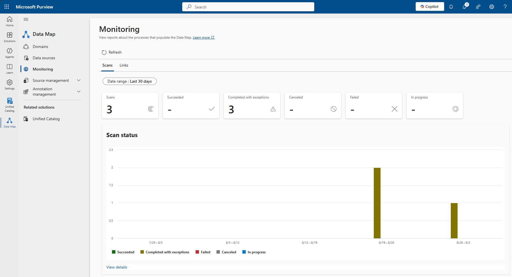

# Purview Deployment

## Overview
This guide outlines the steps to deploy and integrate Microsoft Purview with Microsoft Fabric for unified governance, lineage, and data discovery.

## Prerequisites
- Azure Subscription
  - Owner or User Access Administrator on target Resource Group.
  - Sufficient quota for required services.
- Identities & Access
  - Fabric Admin permissions for integration tasks.

- [Purview Provisioning](./SetupPurview.md) has been complete.  

## Deployment Steps

1. Configure Data Map for Fabric
   - Open https://purview.microsoft.com.
   
   - From the Quick Navigation or, from the home screen, select **Data Map**.
   - From the Domains screen, select **New collection**.
     - NOTE: This setup assumes a new Purview Account was created and no collections exist under the Default domain.
     
   - On the New collection flyout panel:
     - *Display name*: Enter a unique collection name. For the purpose of this solution, we are using Fabric MAAG.
     - *Description*: For example, Collection with all the Fabric assets.
     - *Collection admins*: Select at least 2 Collection admins.
   - Under the Data Map navigation, select **Data sources**.
     - On the visual, select the **Register** (waffle on the lower left corner) icon on the Fabric MAAG collection tile.

     
     - On the Register data source flyout panel filter box, enter: *Fabric*.
     - Select the Fabric (includes Power BI) tile.
     - Select **Continue**.
     - On the Register data source (Fabric) flyout panel:
       
       - *Data source name*: Provide a unique name, for example: Fabric-Zln
       - *Tenant ID*: Prepopulated with your Azure tenant ID.
       - *Domain*: Prepopulated with the Default domain name.
       - *Collection*: Prepopulated with the collection you just created, i.e., Fabric MAAG.
       - Select **Register**.
     - On the visual, select the *New scan* icon on the the Fabric-ZLn tile
     - On the Scan "Fabric-Zln" flyout panel:
       
       - *Name*: Use the default name or create your own.
       - *Personal workspaces*: For the purposes of this solution, select Exclude.
       - *Connect with integration runtime*: Leave as default.
       - *Credential*: Leave as default.
       - **IMPORTANT**: select Show more on the *Before you set up your scan you must give the managed identity of the Microsoft Purview account permissions to connect to your Fabric.*
         - You will notice the SAMI information. In order to connect Purview and Fabric, you need to enable the API usage under the Fabric->Admin portal->Tenant settings. Leave this tab or window open.
         - In a new tab or browser window, sign in to Microsoft Fabric (https://app.fabric.microsoft.com) using your admin account credentials.
         - Select Fabric settings and then from the menu select **Admin portal**.
         - In the Admin portal navigation pane, select **Tenant settings**.
         - In the Filter by keyword box, enter: *api*.
         - Scroll down until you see the heading for **Admin API settings**.
         - Expand *Service principals can access read-only admin APIs*.
         - Select **Enabled**.
         - Expand *Enhance admin APIs responses with detailed metadata*.
         - Select **Enabled**.
         - Expand *Enhance admin APIs responses with DAX and mashup expressions*.
         - Select **Enabled**.
         - Before we can continue, we must provide the SAMI account (above) access to the Fabric admin APIs. This requires the creation of a security group for your SAMI. Leave this tab or window open.
         - In a new tab or browser window, navigate to https://portal.azure.com. 
         - From the Microsoft Azure search box, enter: *Groups*. 
         - Select **Groups**.
         - On the Overview screen, select: **New group**.
           
           - *Group type*: Security
           - *Group name*: Choose a unique, relevant name. For this purposes of this solution, we used Purview Service Principals.
           - *Group description*: A security group for Purview managed identities.
           - *Membership type*: Assigned.
           - Under Owners, *select the No owners selected* link.
           - Add at least 2 owners to the group.
           - Under Members, *select the No members selected* link.
           - Add the SAMI identity provisioned earlier.
             - NOTE: This is the account listed on the Purview->Scan "Fabric-Zln" flyout panel.
           - Select **Create**.
         - Once the group is created, navigate back to the Fabric Admin portal. 
         - In the *Service principals can access read-only admin APIs* section, under *Apply to->Specific security groups*, add the group you just created in Azure (i.e., Purview Service Principals).
         - Select **Apply**.
           
           - NOTE: You will receive a message stating, Applying changes | Tenant setting changes will be applied within the next 15 minutes. Wait the necessary 15 minutes before proceeeding to the next step.
         - Navigate back to the Purview->Scan "Fabric-Zln" flyout panel.
         - Select Test connection.
           - If you receive a successful check, proceed to the next step. Otherwise, review the report or wait a few more minutes for the Fabric tenant setting changes to be applied.
         - Select **Continue**.
         - On the Scope your scan panel:
           - Select **No**.
           - Select **Continue**.
         - On the Set a scan trigger panel:
           - For the purposes of this solution, select **Once**.
           - Select **Save and run**.
         - Under the Data Map navigation, select **Monitoring**.
           
           - Monitor the status of your scan from here. Select **Refresh** every few minutes until the scan is complete.
           - Once complete, review the details by selecting: **View details**.
           - Select the **scan name** in the list to get more details.
           - Select the **Run ID** to get insight into any exceptions that may have been generated.
           - You can download the log using **Download log** to get more insights into the exceptions and how to resolve them.
         - Under the Data Map navigation, select **Domains**.
         - Select the Fabric MAAG collection under the Default domain.
         - You should now see a count of assets within your collection.
         
        - Under the Data Map navigation, under Related solutions, select **Unified Catalog**.
        - Under the Unified Catalog navigation, select **Discovery->Data assets**.
        - Select the Microsoft Fabric tile.
        - Select the Fabric workspaces tile.
        - Select the Fabric_MAAG workspace.
        - Expand Data Engineering->Lakehouse and validate items are in the list.
2. Configure Data Products in the Unified Catalog
   - Open https://purview.microsoft.com.
   - Select **Unified Catalog**.
   - Select **Catalog management->Governance domains**.
   - Select **New governance domain**.
   
   - In the New governance domain popup window:
      - *Name*: Sales
      - *Description*: Governance domain containing data products, glossaries, and OKRs connected to the administration of our Sales LOB. For example, monitoring of Azure, Fabric, and Power BI.
      - *Type*: Line of business
      - *Parent*: Blank
      - Select **Create**.
   - On the newly created Sales governance domain, on the Data products tile, select **Go to data products**.
   - Select **New data product**.
   
   - In the New data product popup window: 
      - *Name*: Sales Assets
      - *Description*: This provides insights into the Sales reports and datasets.
      - *Type*: Dashboard/reports
      - *Audience*: Business analyst, Business user, BI engineer
      - *Owner*: Provide at least 2 owners
      - Select **Next**.
      - *Governance domain*: leave as default.
      - *Use cases*: Ability to run reports
      - *Mark as "Endorsed"*: unchecked.
      - Select **Create**.
      - Select **Add data assets**.
      - Select **Done**.
      - On the Find and select panel, under the Data section, select **Report**.
      - Select MAAG_SalesDashboard.
      - Select **Add**.
   - Wait for the assets to be successfully added.
   - Locate Terms of use and select **Add**.
      - TBD.
   - Locate Documentation and select **Add**.
      - TBD.
   - Select Manage policies
   - On the Manage access policies flyout panel:
      - *Access time limit*: For the purposes of this solution, we selected 1 year.
      - *Approval requirements*: For the purposes of this solution, we left all settings as default.
      - *Access request approvers*: At a minimum, select 2 users.
      - *Digital attestations*: For the purposes of this solution, we left all settings as default.
      - Select **Save changes**.
   - Select **Publish**.

## Appendix
- References
  - [Microsoft Purview Documentation](https://learn.microsoft.com/en-us/fabric/admin/)