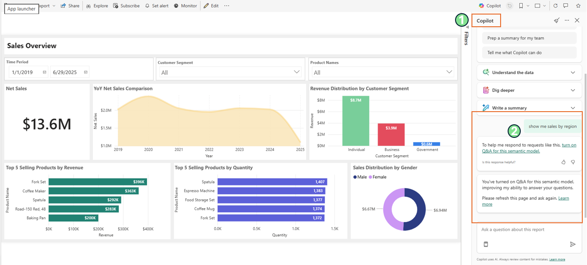
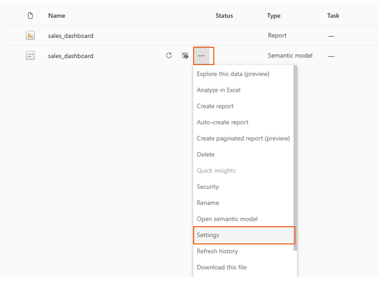
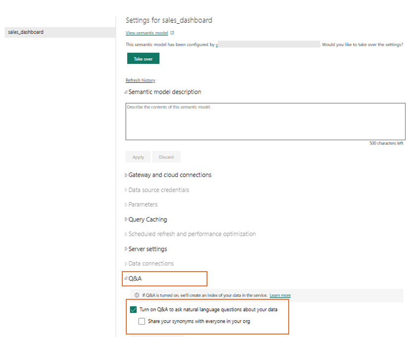

# Enable Q&A for the Semantic Model

This guide explains how to enable Q&A on the semantic model to allow Copilot for Power BI to answer questions about the **entire semantic model**—including data not currently visible in the report.

---

## Overview

By default, Copilot for Power BI answers questions based on the visuals displayed on the current report page. If you want Copilot to query all tables and fields in the semantic model, you need to enable Q&A.

When Q&A is not enabled and you ask a question that requires semantic model access, Copilot will respond with: *"To help me respond to requests like this, turn on Q&A for this semantic model."* Clicking **turn on** in this message will automatically enable Q&A for the semantic model.

---

## Manual Steps to Enable Q&A

1. In your Fabric workspace, navigate to the **`reports`** folder
2. Locate the **semantic model** associated with the sales dashboard report (it will have the same name as the report with a database icon)
3. Click on the **three dots (...)** next to the semantic model and select **Settings**

   

4. Expand the **Q&A** section
5. Toggle **Turn on Q&A to ask natural language questions about your data** to **On**
6. Click **Apply** to save the changes

   

> **Note:** After enabling Q&A, it may take a few moments for the changes to take effect. You may need to refresh your report.

---

## Sample Questions (Requires Q&A Enabled)

Once Q&A is enabled, you can ask Copilot questions that go beyond the visible report visuals:

| Topic | Sample Question | What You'll Learn |
|-------|-----------------|-------------------|
| Top Regions by Revenue | "Show the top 5 regions by revenue as a table" | Highest revenue-generating regions and geographic sales distribution |
| Payment Method Breakdown | "Can you show me the breakdown of sales by payment method?" | Revenue distribution across payment methods (VISA, MasterCard, PayPal, Discover) and customer payment preferences |

---

## Related Documentation

- [Copilot for Power BI Guide](./CopilotForPowerBIGuide.md) - Overview and questions from report visuals
- [Power BI Deployment Guide](./DeploymentGuidePowerBI.md) - Deploy the sales dashboard

---
