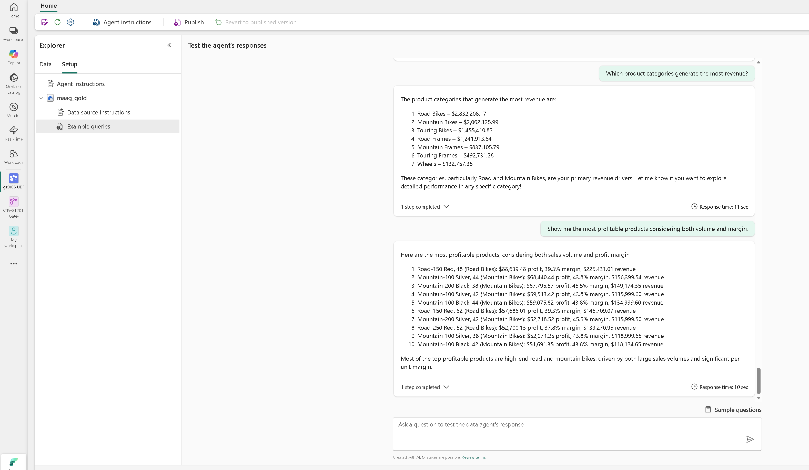

# Fabric Data Agent Guide

After you have deployed your solution, you will be able to use the Fabric Data Agent deployed and set up already. 

If you prefer, you can add your own Azure Data Agent to get data analysis features from Fabric built-in AI capabilities. You can follow [Microsoft's Fabric Data Agent Guide](https://learn.microsoft.com/en-us/fabric/data-science/how-to-create-data-agent) to create or update the Fabric Data Agent, and use the materials provided here to set up your agent quickly. Steps to create a new Fabric Data Agent: 

- Create new item, search for data agent, you will see Fabric Data Agent,
- Create a Fabric Data Agent with a name, for example, `UDF_Data_Agent`,
- Add the Lakehouse named `maag_gold`  in the Fabric workspace as your data source,
- Use the Agent configuration files provided below to set up your Fabric Data Agent. 

## 📁 Agent Configuration Files

This folder contains essential configuration files for setting up your Fabric Data Agent to deliver optimal intelligence based on your data.

### Core Setup Files

**[Agent Instructions - Master Prompt](./fabric_data_agent/agent_instructions.md)**  
Contains the primary instructions and behavior guidelines for your Fabric Data Agent. This file establishes the agent's role, scope, and response patterns.

**[Data Source Description](./fabric_data_agent/data_source_descriptions.md)**  
Provides a description of the data source. 

**[Data Source Instructions](./fabric_data_agent/data_source_instructions.md)**  
Provides detailed information about your data structure, table relationships, and query patterns. This helps the agent understand your data and deliver more accurate, efficient responses.

**Example Question and KQL Query Set**

You can provide example questions and corresponding SQL query code as well. In the `docs/fabric_data_agent` folder, you will find the below files as starters:

1. example_question_1.md and example_sql_code_1.md
2. example_question_2.md and example_sql_code_2.md
3. example_question_3.md and example_sql_code_3.md

### Testing the Data Agent

Once the Data Agent is set up with the above agent configuration files, you will be able to chat with the agent right away. You can also publish your data agent for others to use. Below is the user interface you can expect ([link to more sample test questions](./fabric_data_agent/user_sample_test_questions.md)): 

## 💡 Customization Tips

- Replace sample data references with your organization's actual data structure
- Add domain-specific terminology and business context to the master instructions
- Include your most common business questions in the training examples
- Update query patterns to match your specific analytics needs

