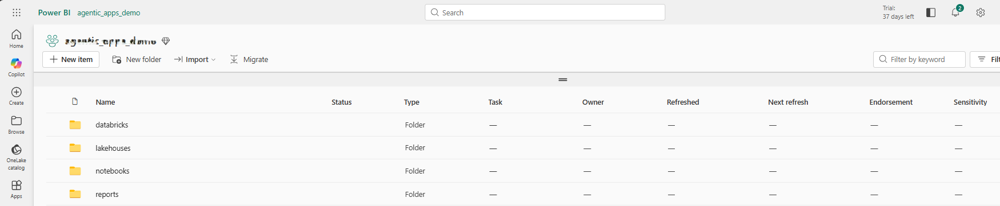

# Sample Workflow

To help you get started, here’s a **sample process** to follow.

> _Note: Average response time for report loading is 10-15 seconds._  

## **Process**
Execute a guided validation process across Fabric Workspace, Lakehouses, Notebooks, Power BI, Databricks, and Purview to ensure seamless data movement from Bronze to Gold layers, validated reporting, and complete data lineage visibility.

### **Fabric Testing**

#### Step 1
- Task: Validate 4 folders are created successfully in the Fabric Workspace  
  - databricks
  - lakehouses
  - notebooks
  - reports

> _Note: The databricks folder is included only when the user has completed deployment and configuration of Azure Databricks for Fabric integration._
	
#### Step 2    
- Task: Browse the resources in each folder and subfolders.
  
#### Step 3  
- Task: Open notebooks folder and verify below resources:
	- **bronze_to_silver:** Contains 16 notebooks to process data in bronze lakehouse and populate data models in the silver lakehouse
	- **data_management:** Contains 5 notebooks to truncate and delete tables if a process needs to be rerun
	- **schema:** Contains  8 notebooks to create data models
	- **silver_to_gold:** Contains 19 notebooks to take data from silver tier with necessary processing and  insert data to tables in gold lakehouse
   
#### Step 4
- Observe: You will also see two runner notebooks:
	- **run_bronze_to_silver:** This notebook runs all the notebooks related to data processing from bronze to silver
	- **run_silver_to_gold:** This notebook runs all the notebooks related to data processing from silver to gold
 
#### Step 5
- Task: Navigate to the notebooks/schema folder in the Fabric workspace.
- Task: Verify that notebooks are available to create data models for the following domains:
	- Customer
	- Product
	- Sales
	- Finance
   
 #### Step 6
  
- Task: Open the targeted notebook **'model_shared_gold'** in the Fabric workspace.
- Task: Confirm that the notebook interface loads successfully without errors.
- Task: Review the notebook content to verify the database schema and table structures referenced or defined within it.
     
### **Lakehouse Testing**  

- Task: Navigate to the lakehouses folder and verify that three lakehouses are displayed.
- Task: Open the maag_gold lakehouse and confirm the schema and list of tables are visible.
- Task: Access the SQL endpoint associated with maag_gold.
- Task: Run T-SQL queries (e.g., **SELECT COUNT(*) FROM [maag_gold].[salesadb].[order]**) and verify that valid row counts are returned.

  
### **Notebook Testing**  

#### Step 1
- Task: Navigate to the notebooks folder.
- Task: Opens the bronze_to_silver subfolder.
- Observe: list of related notebooks.
- Observe: Pen any notebook  verify that the notebook details are loaded correctly.
     
#### Step 2    
- Task: Navigate to the notebooks folder.
- Task: Opens the silver_to_gold subfolder.
- Observe: list of related notebooks.
- Task: Open any notebook  verify that the notebook details are loaded correctly.
     
#### Step 3
- Task: Navigate to the notebooks folder.
- Task: Opens the  data_management subfolder.
- Observe: list of related notebooks.
- Task: Open any notebook  verify that the notebook details are loaded correctly. e.g. truncate_all_tables_gold
     
#### Step 4
- Task: Navigate to the notebooks folder.
- Task: Verify that two runner notebooks is displayed.
- Task: Open any notebook  verify that the notebook details are loaded correctly.         

### **Power BI Testing** 

#### Step 1
- Task: Open the Fabric workspace and Open reports folder and navigate to sales_dashboard,

#### Step 2  
- Observe: YOY Net sales Comparison chart.
- Observe: trend line and identify any downward trend in the data.
- Task: Hover over a specific year on the trend line(e.g. 2022)
- Observe: Verify that the exact Net Sales value for that year is displayed in the tooltip.
 
#### Step 3
- Observe: Revenue Distribution by Customer Segment visual.
- Observe: Review the distribution across customer segments:
  - Individual
  - Business
  - Government
- Task: Compare the thresholds and contribution of each segment to overall revenue.   

### **Azure Databricks and Fabric integration**    

- Task: Open fabric workspace and navigate to databricks folder
- Task: Navigate to **maagcatalog** mirrored Azure Databricks and validate the list of tables under sales schema - order, orderline and orderpayment
  

### **Purview Testing** 

#### Step 1
- Task: Open Purview and select Data Map
- Task: Navigate Data Sources and validate Fabric Data source is Available in Collection created 
  - Verify Fabric is successfully connected to Microsoft Purview, and Purview collections appear in Fabric.
    
#### Step 2     
**Scan and Report**
  - Task: Navigate to Data Map -> Monitoring
  - Observe: Scan details and see information on Cards and Graph
 
#### Step 3     
**Data Lineage and metdata review**
- Task: Navigate to Unified Catalog -> Catalog management -> Data Products
- Task: Select Data Product Sales Resources.
- Task: Open maag_gold. Observe Data asset lineage   
       
Unified data foundation using Microsoft Fabric, Purview, and Azure Databricks for integrated, governed, and analytics-ready insights.
