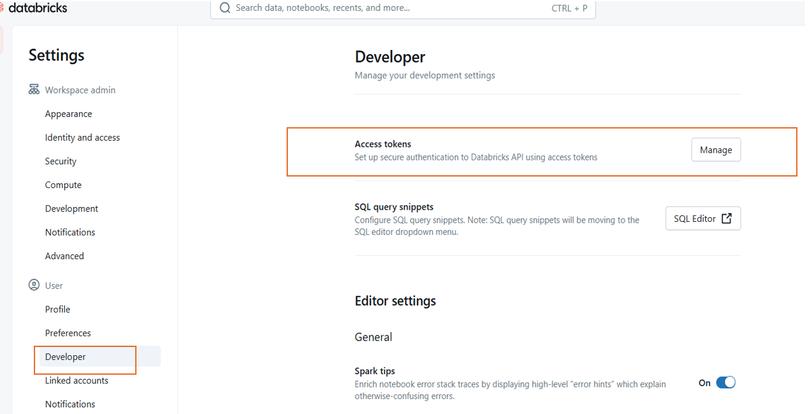
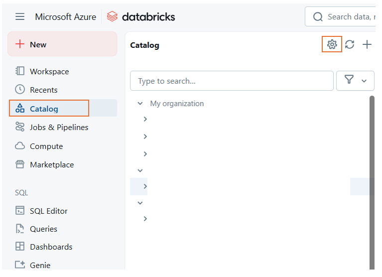

# Provisioning Azure Databricks

This guide helps an organization to set up  set up Azure Databricks for Microsoft Fabric Mirrored Catalog. For more, see [Microsoft Fabric Mirrored Catalog From Azure Databricks](https://learn.microsoft.com/en-us/fabric/mirroring/azure-databricks).

---

## Prerequisites

- Microsoft Fabric is already provisioned. [Provisioning Microsoft Fabric](./SetupFabric.md)
- You have access to the Azure Portal and permission to create resources (or ask your Azure admin).

---

## Step 1: Create Azure Databricks Workspace

You can create an Azure Databricks workspace using several methods. The fastest approach is to use the Azure Portal. For step-by-step instructions, see [Deploy a workspace using the Azure Portal](https://learn.microsoft.com/en-us/azure/databricks/admin/workspace/create-workspace).

1. Go to the [Azure Portal](https://portal.azure.com/).
2. Click **Create a resource** and search for "Azure Databricks".
3. Click **Create** and fill in the required fields:
   - Choose your Subscription and Resource Group (or create a new one).
   - Enter a Workspace Name.
   - Select the **Premium** pricing tier.

  
4. Click **Review + Create** and then **Create**.
5. When deployment is complete, click **Go to resource**.
6. Click **Launch Workspace** and copy the workspace URL for later.

---

## Step 2: Add Users and Admins

1. In your Databricks workspace, click your user icon (top right) > **Settings**.
2. Go to **Identity and access** > **Users**.
3. Click **Manage** and add users who need access.
4. To make a user an admin: click the three dots `...` next to their name, choose **Edit**, and turn on **Admin access**.

---

## Step 3: Enable External Data Access

External data access is required for Fabric to mirror Databricks data. Request your global tenant administrator to help you to set up this. 

1. In Databricks, click the **Catalog** icon (left menu).
2. Click the **gear** icon at the top of the Catalog pane and select **Metastore**.
3. On the **Details** tab, enable **External data access**.
4. If you see a message that only a global admin can enable this, ask your Azure admin for help. When complete the admin will see this view: 

---

## Step 4: Find Required Values in Databricks
You will need the following values for deployment process later. Be sure to record them for future reference.

- **Workspace URL:**  
  - Open your Databricks workspace in a browser.  
  - The URL in the address bar is your Workspace URL.  
    - Example: `https://adb-1234567890123456.7.azuredatabricks.net` 
  

      

- **Personal Access Token (PAT):**  
  - In Databricks, click your profile icon (top-right).  
  - Navigate to **User Settings → Access Tokens → Generate New Token**.  
  - Copy the token (it begins with `dapi...`) and store it in a secure location. You will not be able to view this token again after closing the dialog.
  
  
    

- **Cluster ID:**  
  - In Databricks, go to **Compute** and open your cluster.  
  - The Cluster ID is part of the URL.  
    - Example: `.../cluster/1234-567890-abcd123` → Cluster ID = `1234-567890-abcd123`.  
  

      

- **Catalog Managed Location:**
  - In Databricks, go to **Catalogs → Settings**.  

     

  - Under **External Location**, select your location to view its details.

     

  - The managed location is shown as a URL (commonly starting with `abfss://`).  

      

---

## Step 5: Connect Databricks to Fabric

1. In your Fabric workspace, click **+ New item**.
2. Search for "Azure Databricks" and select **Mirrored Azure Databricks Catalog**.
3. Choose **New connection**.
4. Enter your Databricks workspace URL (copied earlier, e.g., `https://adb-<WorkspaceID>.azuredatabricks.net`).
5. Name your connection, select **Microsoft Entra ID** for authentication, and sign in.
6. Click **Connect**.

After setup, you can reuse this connection by choosing **Existing connection**.

---

## Next Steps

For deploying Databricks resources, follow instructions the [Deployment Guide for Databricks](./DeploymentGuideDatabricks.md). 
