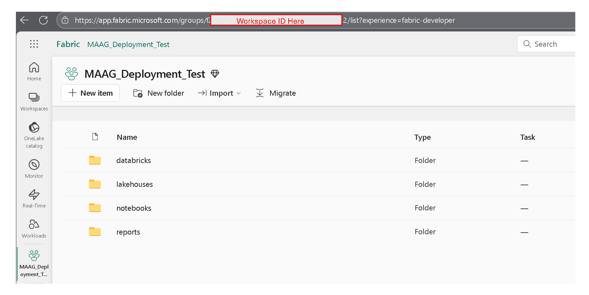

# Provisioning of Microsoft Fabric

This guide provides guide for new organizations to set up their Microsoft Fabric tenant, create a workspace, and manage users. Additional documentation can be found at: [Microsoft Fabric Administration Overview](https://learn.microsoft.com/en-us/fabric/admin/admin-overview).

## Setup Microsoft Fabric Subscription

To set up Microsoft Fabric for your organization, you need:

- Appropriate admin privileges for the Fabric Admin role. For more details, see [Microsoft Fabric administration](https://learn.microsoft.com/en-us/fabric/admin/microsoft-fabric-admin).
- Purchase a Fabric subscription. For more details, see [Buy a Microsoft Fabric subscription](https://learn.microsoft.com/en-us/fabric/enterprise/buy-subscription#prerequisites).
- Choose a SKU/Capacity. For more details, see [Capacity and SKUs](https://learn.microsoft.com/en-us/fabric/enterprise/licenses#capacity).
- Enable Microsoft Fabric for your organization. For more details, see [Enable Microsoft Fabric for your organization](https://learn.microsoft.com/en-us/fabric/admin/fabric-switch).

## Create a Fabric Workspace

The global administrator of your Azure Tenant can create a Fabric workspace by following below steps: 

1.  Navigate to [Microsoft Fabric Page](https://app.fabric.microsoft.com/).
2.  Click on Data Engineering experience.
3.  Click on Workspaces from left Navigation.
4.  Click on + New Workspace.
  5.  Provide Name of Workspace.
  6.  Provide Description of Workspace (optional).
  7.  Click Apply.
8.  Retrieve Workspace ID from URL for future steps. For additional assistance, please see [Workspace admin settings](https://learn.microsoft.com/en-us/fabric/admin/portal-workspace#identify-your-workspace-id). 
9.  Assign administrator(s) and users of the workspace.

Additional information can be found: 

- Creating and managing workspaces: [Create a workspace](https://learn.microsoft.com/en-us/fabric/fundamentals/create-workspaces)
- Assigning a workspace to a different capacity: [Assign workspace capacity](https://learn.microsoft.com/en-us/fabric/fundamentals/workspace-license-mode)
- Understanding Security in Microsoft Fabric: [Security in Microsoft Fabric](https://learn.microsoft.com/en-us/fabric/security/security-overview).

Once your workspace is created, you can get **Workspace ID** from the url, as illustrated by figure below. Please copy the Workspace ID for **Next Steps**.  

### **Next Step**s 

The person(s) has been assigned as the Fabric Workspace Administrator or contributor can follow the [Deployment Guide for Fabric](./DeploymentGuideFabric.md) to deploy the resources for **Core Medallion Architecture in Microsoft Fabric**. 

