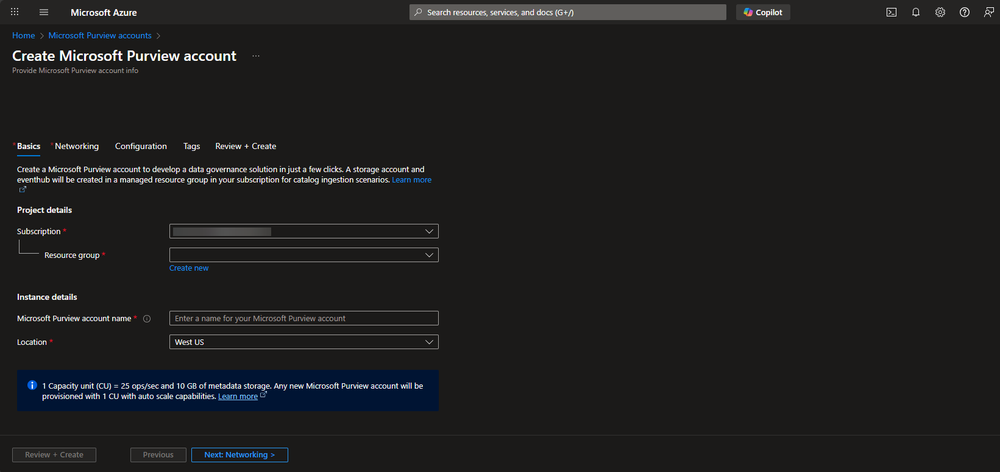

# Purview Setup Guide

## Overview
This guide outlines the steps to setup Microsoft Purview.

## Prerequisites
- Azure Subscription
  - Owner or User Access Administrator on target Resource Group.
  - Sufficient quota for required services.
- Identities & Access
  - Fabric Admin permissions for integration tasks.

## Deployment Steps
1. Open https://portal.azure.com.
2. Purview Account Provisioning
   - If you have an existing Microsoft Purview account, go to step 3. Otherwise, continue with Purview account provisioning.
   - From the Microsoft Azure search box, enter: Microsoft Purview accounts.
   - Select **Microsoft Purview accounts** from the **Services** section.
   - Select **Create Microsoft Purview account**.
   
   - Under the **Basics** tab:
     - *Name*: `pvw-<domain>-<env>`
     - *Resource group*: Best practice is to create a new, dedicated resource group.
     - *Location*: Select a region where most of your data is governed.
   - Under the **Networking** tab:
     - *Connectivity method*: This will depend on the customer. For the purpose of this solution, we are using "all networks".
   - Under the **Configuration** tab:
     - For the purpose of this solution, no Kafka configuration is required.
   - Under the **Tags** tab:
     - This will depend on the customer. For the purpose of this solution, we are not adding tags.
   - Under the **Review and Create** tab, select **Create**.

## Additional Information 
- References
  - [Microsoft Purview Documentation](https://learn.microsoft.com/en-us/fabric/admin/)
  
    

## Next Steps 

Follow [Purview Deployment Guide](./DeploymentGuidePurview.md) to complete integration with Fabric. 