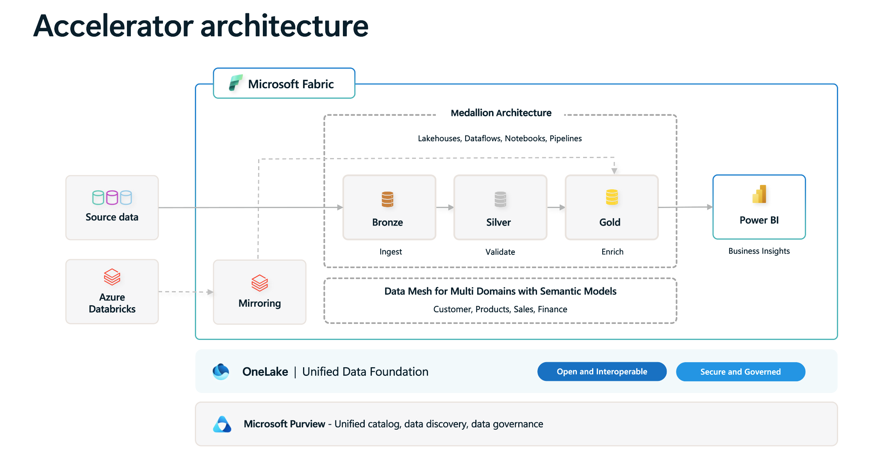
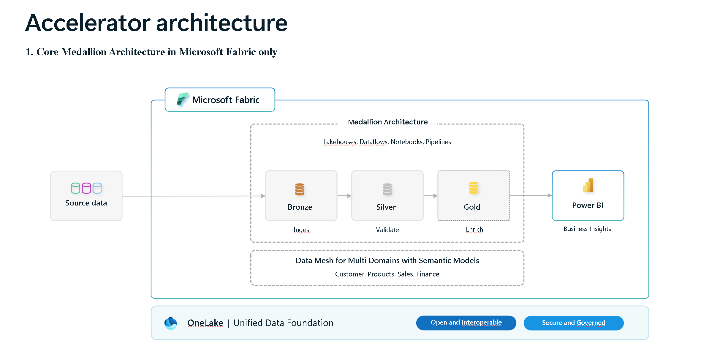
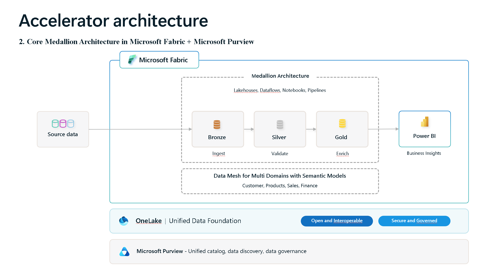

# Solution Architecture and Four Deployment Choices

We have built a flexible and configurable architecture with plug-and-play options, providing you with four architecture choices. You can deploy any of the following four architectures based on your organizational needs:

1. **Core Medallion Architecture in Microsoft Fabric only**: This gives you medallion architecture with 48 data engineering PySpark notebooks and 4 utility scripts. For details, please refer to [Guide to Fabric Notebooks](./NotebooksGuideFabric.md). There are two runner notebooks that automate execution to move data from source files to Bronze, validate in Silver, and enrich in Gold. The data models in the medallion architecture support multiple domains: **shared** (**customer**, **product**), **sales**, and **finance**. You can easily add more domains to the data model or add more entities to your chosen domain. The architecture framework and code are designed to be easily updated, extended, and scaled up. Prebuilt PowerBI semantic models and dashboards provide quick business insights:
   - Total sales for a period
   - Year-over-year sales comparison
   - Revenue by customer segment
   - Top-selling products by revenue
   - Top-selling products by quantity
   - Sales distribution by gender
2. **Core Medallion Architecture in Microsoft Fabric + Microsoft Purview**: On top of the capabilities provided by the Core Medallion Architecture, you will get greater capabilities by using Microsoft Fabric and Purview together. You will get Purview's comprehensive governance capability. For more details, please refer [Use Microsoft Purview to Govern Microsoft Fabric](https://learn.microsoft.com/en-us/fabric/governance/microsoft-purview-fabric). In summary, you will get 
   - Microsoft Purview Unified Catalog automatically review metadata about your Microsoft Fabric Items.
   - Use Purview to discover, classify, and protect Fabric Data. You can apply sensitivity labels for all Fabric items. 
   - Microsoft Purview Data Loss Prevention (DLP). Currently Fabric DLP supports is limited to Power BI semantic models. 
3. **Core Medallion Architecture in Microsoft Fabric + Azure Databricks**: On top of the capabilities provided by the Core Medallion Architecture, you will get 7 data engineering notebooks in Azure Databricks to load raw data into Databricks lakehouse tables in the **sales** domain with schema name `salesadb`. For details, please refer to [Guide to Databricks Notebooks](./NotebooksGuideDatabricks.md). There is one runner notebook that automates execution to move data from source files to lakehouse tables.  You do not need to move the data into Azure Fabric. You will be able to use Fabric Databricks mirroring and shortcut from the Gold lakehouse to review or use the data. 
4. **Core Medallion Architecture in Microsoft Fabric + Azure Purview + Azure Databricks**: You will get all the capabilities described by previous items 1-3. You will be able to leverage the strengths of all three platforms to build comprehensive data architecture that delivers managed and governed data products.

Below architecture illustrates the architecture for option 4, **Core Medallion Architecture in Microsoft Fabric + Azure Purview + Azure Databricks**.

If you choose to deploy this architecture, you will need to follow the deployment guide step by step to set up and deploy all resources. If you choose the option 1, 2, or 3. You can deploy the respective parts by following the [Deployment Guide](./DeploymentGuide.md) accordingly. 

Below diagram illustrates the architecture if you choose to deploy option 1, **Core Medallion Architecture in Microsoft Fabric only**.

Below diagram illustrates the architecture if you choose to deploy option 2, **Core Medallion Architecture in Microsoft Fabric + Microsoft Purview**.

Below diagram illustrates the architecture if you choose to deploy option 3, **Core Medallion Architecture in Microsoft Fabric + Azure Databricks**.

